# Trustio — First-Time User UX Audit

**Target:** https://trustio.com.br (production) · **Date:** 22 Sep 2026 (one day before paid early access on 23/09, nine days before public launch on 01/10) · **Mode:** read-only · **Report language:** English (site copy quoted in PT-BR)

> **Guardrail statement.** No form was submitted: 0 submissions, 0 requests to the waitlist API, 0 blocked-submit events. No character was typed into any Stripe field, and Pagar/Assinar was never clicked. Each of the 7 Stripe payment links was opened **exactly once**, for a page-load screenshot only (ledger in §2.4). The voice orb got one click, on desktop only. No login, no account, no CAPTCHA. Files were created only inside `audit/`, with no git stage, commit or push (`git status` in §10.7).

---

## 1. Executive summary

The site is visually mature: tokens match the brand spec, and Lighthouse accessibility scores 100 on all 12 pages. Conversion and trust are not ready for 23/09. **UX Maturity Score: 55/100.**

**Top 5 issues**

1. **Stripe checkout bills as "JUICYSCORE"**, with no Trustio logo, and only card appeared (F17, F20).
2. **"Dados no Brasil" contradicts the privacy policy** (F36). The ISO/ANPD seals are unverifiable, and there is no CNPJ or DPO (F33–F37).
3. **Three competing paths** (conta, lista, pré-assinatura); the waitlist's pre-sale only e-mails a link (F06, F28).
4. **Broken B2B proof:** the live-call demo has no DNS, and demo requests are mailto only (F10, F31).
5. **The waitlist counter is clock-generated**, and the CSP blocks analytics (F05, F44).

| Dimension | Weight | Score | Why |
|---|---|---|---|
| Value proposition | 20 | **12** | Strong H1; dual audience; no desktop CTA above the fold |
| IA / navigation | 15 | **8** | 12-item header; 23-screen home; orphaned /seats |
| Conversion flow | 20 | **7** | Three paths; off-brand checkout; dead demo |
| Trust & credibility | 15 | **5** | Unverifiable seals; synthetic counter; residency conflict |
| Visual / brand | 10 | **8** | Tokens match; Stripe drifts |
| Accessibility | 10 | **8** | Lighthouse 100; minor focus and error gaps |
| Performance / mobile | 10 | **7** | Content pages 91–94; home 73; voice 38 (lab) |
| **Total** | **100** | **55** | |

---

## 2. Scope & method

### 2.1 Pages and inventories

Page inventory, built from `/sitemap.xml` plus the header, mobile and footer navigation:

| Page | Source | HTTP | H1 | Doc height D / M (px) | In header nav | axe violations (D/M) |
|---|---|---|---|---|---|---|
| `/` | sitemap | 200 | IA pessoal e empresarial. Sob seu controle. | 15,007 / 19,637 | yes | 0 / 1 |
| `/juridico/` | sitemap | 200 | IA jurídica. Sob seu controle. | 10,280 / 14,525 | yes | 0 / 0 |
| `/modelos.html` | sitemap | 200 | Modelos Poderosos | 5,043 / 6,589 | yes | 0 / 1 |
| `/voice.html` | sitemap | 200 | Agentes que resolvem de verdade. Por voz, por texto, em todo canal. | 9,470 / 16,810 | yes | 8 / 8 |
| `/planos.html` | sitemap | 200 | Infraestrutura privada de IA. Contratada em minutos. | 3,398 / 5,608 | yes | 0 / 1 |
| `/espera.html` | sitemap | 200 | Entre na lista de espera. Seu acesso abre no lançamento. | 2,699 / 4,076 | yes | 0 / 0 |
| `/manifesto.html` | sitemap | 200 | Manifesto | 7,955 / 7,320 | yes | 0 / 0 |
| `/fundador.html` | sitemap | 200 | José Edson da Costa | 5,613 / 7,253 | no | 0 / 0 |
| `/cadastro.html` | sitemap | 200 | Crie sua conta agora. O chat abre em 1º de outubro. | 2,414 / 3,732 | no | 0 / 0 |
| `/entrar.html` | sitemap | 200 | Entrar. Você cai direto no seu portal. | 1,700 / 2,073 | yes | 0 / 0 |
| `/privacidade.html` | sitemap | 200 | Como tratamos os seus dados. Em português, sem rodeio. | 3,602 / 5,613 | no | 0 / 0 |
| `/seats.html` | sitemap | 200 | IA Privada e sem censura*. Seats individuais disponíveis. | 1,676 / 2,025 | no | 0 / 0 |
| `/console/` | CTA on /voice.html (robots: Disallow) | 200 | (app UI) | — | no | not run |
| `voice.trustio.com.br/credito-jus` | CTA on /voice.html | DNS: no record | — | — | no | — |
| `/seats.html` (brief: "may be missing") | sitemap only | 200 | exists — logged as orphan page, **F04/F24** | | | |

Navigation map (desktop header / mobile menu / footer, from `/`):

<details><summary>Desktop header</summary>

- Trustio → `index.html`
- Plataforma → `#plataforma`
- Modelos Poderosos → `modelos.html`
- VoiceAI POWERED BY XSPACE → `voice.html`
- Segurança → `#seguranca`
- Implantação → `#implantacao`
- Jurídico → `/juridico/`
- Planos → `planos.html`
- Lista de espera → `espera.html`
- Manifesto → `manifesto.html`
- Entrar → `entrar.html`
- Falar com a Trustio → `#contato`
</details>
<details><summary>Mobile menu</summary>

- Plataforma → `#plataforma`
- Modelos Poderosos → `modelos.html`
- VoiceAI POWERED BY XSPACE → `voice.html`
- Segurança → `#seguranca`
- Implantação → `#implantacao`
- Jurídico → `/juridico/`
- Planos → `planos.html`
- Lista de espera → `espera.html`
- Manifesto → `manifesto.html`
- Falar com a Trustio → `#contato`
- Entrar → `entrar.html`
</details>
<details><summary>Footer</summary>

- Trustio → `index.html`
- Plataforma → `#plataforma`
- Modelos Poderosos → `modelos.html`
- VoiceAI · xSpace → `voice.html`
- Jurídico → `/juridico/`
- Segurança → `#seguranca`
- Implantação → `#implantacao`
- Planos → `planos.html`
- Lista de espera → `espera.html`
- Manifesto → `manifesto.html`
- Fundador → `fundador.html`
- Privacidade → `privacidade.html`
- Contato → `mailto:contato@trustio.com.br`
- Acompanhamento de segurança → `https://github.com/joseedson18jc/trustio-site/blob/main/SECURITY.md`
</details>

The full CTA inventory (93 rows, with label, destination, page and above-fold flag per viewport) is in `data/cta-inventory.csv`. A condensed version is in §6.

### 2.2 Setup

- **Tooling:** Playwright 1.56 with Chromium 1194. Desktop runs at 1440×900 @ DPR 2; mobile at 390×844 @ DPR 3 (iPhone 13 profile, touch).
- **Visits:** each journey starts in a fresh browser context (cookies and storage cleared) to simulate a true first visit, with `locale pt-BR` and `America/Sao_Paulo`.
- **Capture:** console errors and warnings, page errors, failed requests and HTTP ≥ 400 responses → `data/events.jsonl`. Link check covers every href on 12 pages × 2 viewports (76 unique URLs).
- **axe-core 4.x** (WCAG 2.0/2.1/2.2 A+AA + best-practice) on every page at both viewports → `axe/`. **Lighthouse 12** (mobile form factor, simulated throttling) on every sitemap page → `lighthouse/`.
- **Screenshots:** 177 files, named `{journey}-{step}-{slug}-{viewport}-{theme}.png`. Above-the-fold shots use the device DPR. Full-page shots (`…-full-…`) use CSS scale so files stay committable; during the full-page capture only, scroll-reveal blocks are forced visible (otherwise off-screen `.reveal` sections render blank in a stitched image). When a step only scrolls within a page, its full-page reference is the step-01 capture of that page.
- **Evidence panel:** `J2-05-handoff-dns-evidence-*.png` is a rendered panel of DNS results, not a site screenshot. A failed navigation leaves Playwright on a blank page.
- **Measurement caveats:** the runner is a cloud container behind an egress proxy, **outside Brazil**, so Stripe's currency and payment-method presentation may differ for a Brazilian visitor (F19, F20). Lighthouse is lab data, and WebGL renders in software there, which inflates TBT on `/voice.html`.
- **Logs:** 96 journey steps logged in `data/steps.jsonl`; 47 findings (44 observed, 3 inferred; sev 4: 3, sev 3: 13, sev 2: 17, sev 1: 8, sev 0: 6).

### 2.3 Not tested (and why)

| Item | Reason |
|---|---|
| 5-question trial of the uncensored model | Lives behind an account (`/app/`, Supabase chat). No login or account creation per guardrail 4, so none of the 5 questions was used. |
| Live voice session | The /voice.html orb plays pre-recorded clips; no live session exists to open. The "Chamada real" live demo host has no DNS (F10). |
| Stripe Pix / Apple Pay / Google Pay; BRL default | Needs a Brazilian IP and a real wallet-enabled device. Each link could be opened only once (F19, F20). |
| Screen readers (VoiceOver/NVDA), real iOS Safari | Not available in the runner; covered by axe, keyboard and focus checks only. |
| Field Core Web Vitals (CrUX) | Not queried; lab data only. |
| cadastro / entrar submission | Guardrail 4 (no account, no login). |

### 2.4 Guardrail stops and ledger

| Journey / step | Stop |
|---|---|
| J2-03 mobile | Orb tap skipped: one interaction per demo already used on desktop |
| J4-06 desktop + mobile | Form filled with fake data ("Teste Auditoria", teste@exemplo.com); **stopped before submit**, no Enter pressed |
| J4-09 | /cadastro observed only (no account creation) |
| J3-05…08 | Stripe: page load and screenshot only, no field touched |
| Trial / chat | Not reachable without an account (stopped) |

Network-level enforcement: the auditor code aborted any non-GET request to FormSubmit, `api.trustio.com.br` and Supabase, and any POST to trustio.com.br. Aborted during the audit: 4× POST to trustio (Cloudflare RUM beacons; no form traffic). Stripe was reachable only from a dedicated context, guarded by a persisted one-open ledger:

| CTA | Stripe link | Viewport | Opened (UTC) | Times opened |
|---|---|---|---|---|
| Assinar Starter | `https://buy.stripe.com/00wdR96Ia85pcmr6gL5wI05` | desktop | 2026-09-22T20:10:56.295Z | 1 |
| Assinar Pro | `https://buy.stripe.com/aFa4gz1nQ71lbin0Wr5wI06` | desktop | 2026-09-22T20:11:45.546Z | 1 |
| Assinar Dedicado | `https://buy.stripe.com/dRm3cvaYq2L59af34z5wI07` | desktop | 2026-09-22T20:12:07.049Z | 1 |
| Contratar diagnóstico | `https://buy.stripe.com/3cI4gz8Qi0CXdqv5cH5wI04` | desktop | 2026-09-22T20:12:55.654Z | 1 |
| Pré-assinar · entrar em 23/09 | `https://buy.stripe.com/28EcN5aYq4Td9afgVp5wI08` | mobile | 2026-09-22T20:14:50.343Z | 1 |
| Comprar passe | `https://buy.stripe.com/8x228rgiKetN2LRfRl5wI09` | mobile | 2026-09-22T20:15:44.905Z | 1 |
| Pré-assinar · entrar em 23/09#2 | `https://buy.stripe.com/cNifZhd6yfxR9afgVp5wI0a` | mobile | 2026-09-22T20:16:40.076Z | 1 |

---

## 3. Journey timeline

Legend: sev 0 = positive or no problem, 4 = launch blocker. O = observed, I = inferred.

### J1 · Home — first-5-seconds test

Runs: desktop/dark, desktop/light, mobile/dark, mobile/light.

**Step 01 — Fresh visit to / (dark); wait 2.5 s; read first viewport** · `https://trustio.com.br/`

- Expected: Visitor can say what Trustio is, who it is for, and what to do next
- Actual: Desktop: eyebrow + H1 only, lead cut, no CTA in viewport. Mobile: H1, lead and 3 CTAs visible. Light theme identical in structure.
- Friction: **F01** (sev 3, observed); **F02** (sev 2, inferred); **F07** (sev 1, observed); **F09** (sev 0, observed); **F44** (sev 3, observed)

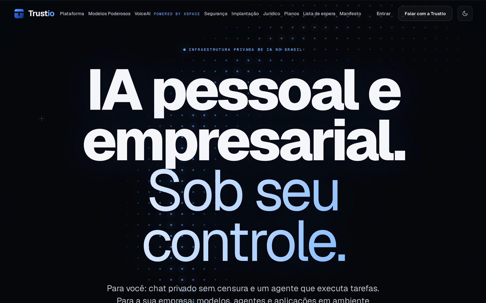 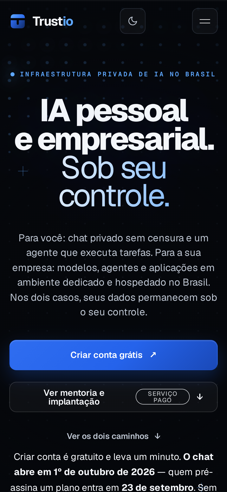

  Other captures: [J1-01-hero-desktop-light.png](./screenshots/J1-01-hero-desktop-light.png), [J1-01-hero-mobile-light.png](./screenshots/J1-01-hero-mobile-light.png), [J1-01-hero-full-desktop-dark.png](./screenshots/J1-01-hero-full-desktop-dark.png), [J1-01-hero-full-desktop-light.png](./screenshots/J1-01-hero-full-desktop-light.png), [J1-01-hero-full-mobile-dark.png](./screenshots/J1-01-hero-full-mobile-dark.png), [J1-01-hero-full-mobile-light.png](./screenshots/J1-01-hero-full-mobile-light.png)

**Step 02 — Scroll to second banner ("Seats individuais")** · `https://trustio.com.br/`

- Expected: Banner states the individual offer and links to its page (/seats.html)
- Actual: Banner: "IA Privada e sem censura*. Seats individuais disponíveis." + live counter (23.493 → 23.625 during the audit). CTAs go to espera.html and planos.html#pessoal, not /seats.html.
- Friction: **F04** (sev 2, observed); **F05** (sev 3, observed)

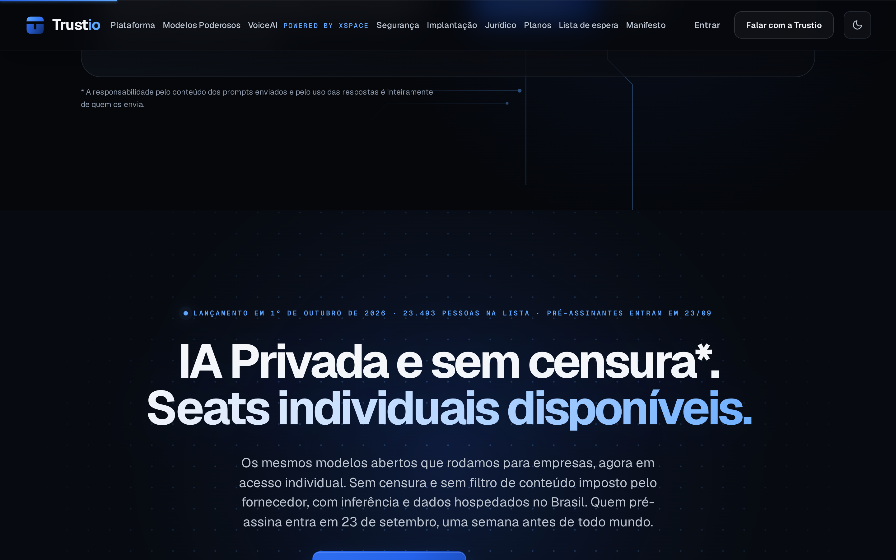 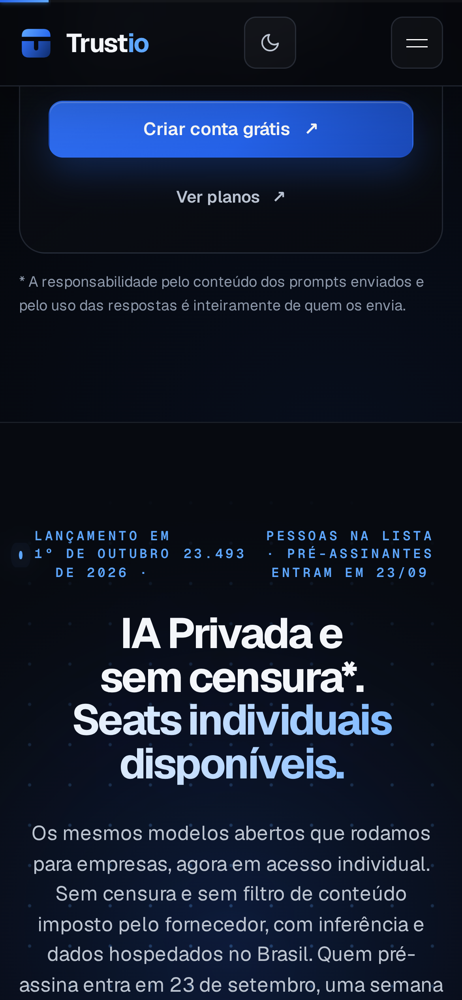

  Other captures: [J1-02-second-banner-desktop-light.png](./screenshots/J1-02-second-banner-desktop-light.png), [J1-02-second-banner-mobile-light.png](./screenshots/J1-02-second-banner-mobile-light.png), [J1-01-hero-full-desktop-dark.png](./screenshots/J1-01-hero-full-desktop-dark.png), [J1-01-hero-full-desktop-light.png](./screenshots/J1-01-hero-full-desktop-light.png), [J1-01-hero-full-mobile-dark.png](./screenshots/J1-01-hero-full-mobile-dark.png), [J1-01-hero-full-mobile-light.png](./screenshots/J1-01-hero-full-mobile-light.png)

**Step 03 — Scan the desktop header** · `https://trustio.com.br/`

- Expected: ≤7 top-level items, one primary CTA
- Actual: Desktop: 12 links + toggle. Mobile: 11-item full-screen menu, taller than the viewport.
- Friction: **F03** (sev 2, observed)

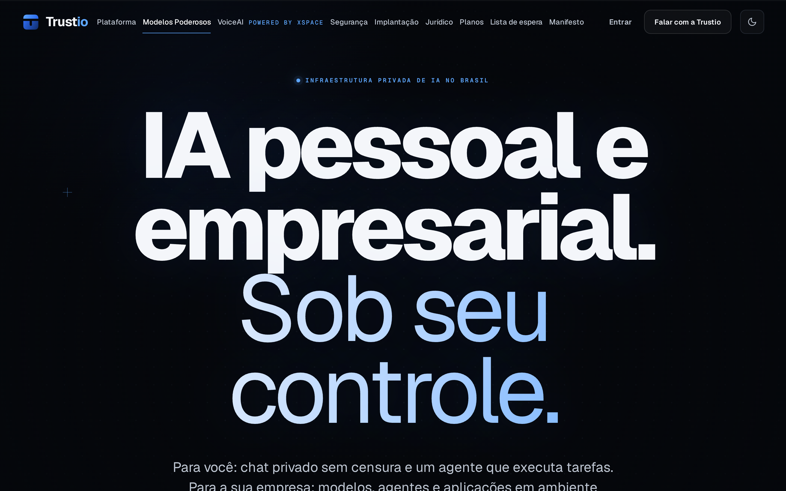 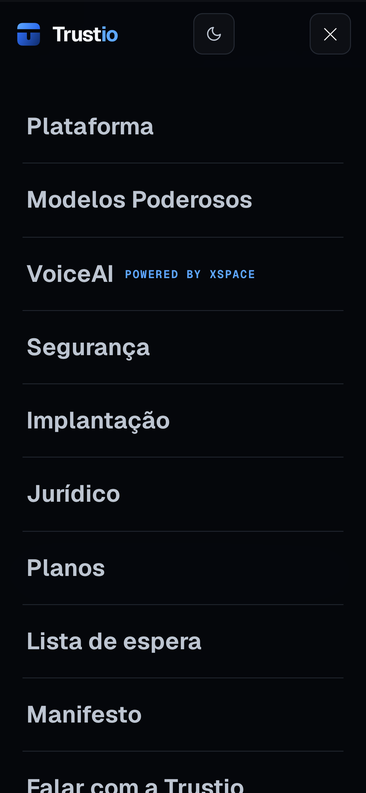

  Other captures: [J1-03-nav-desktop-light.png](./screenshots/J1-03-nav-desktop-light.png), [J1-03-nav-open-mobile-light.png](./screenshots/J1-03-nav-open-mobile-light.png), [J1-01-hero-full-desktop-dark.png](./screenshots/J1-01-hero-full-desktop-dark.png), [J1-01-hero-full-desktop-light.png](./screenshots/J1-01-hero-full-desktop-light.png), [J1-03-nav-open-full-mobile-dark.png](./screenshots/J1-03-nav-open-full-mobile-dark.png), [J1-03-nav-open-full-mobile-light.png](./screenshots/J1-03-nav-open-full-mobile-light.png)

**Step 04 — Follow "Ver os dois caminhos" to #para-quem** · `https://trustio.com.br/`

- Expected: B2C and B2B paths are distinct, each with one clear CTA
- Actual: #para-quem shows B2C and B2B cards. B2C card CTAs: "Criar conta grátis" + "Ver planos"; desktop shows both in viewport.
- Friction: **F06** (sev 3, observed)

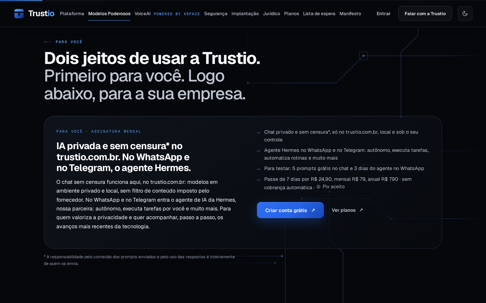 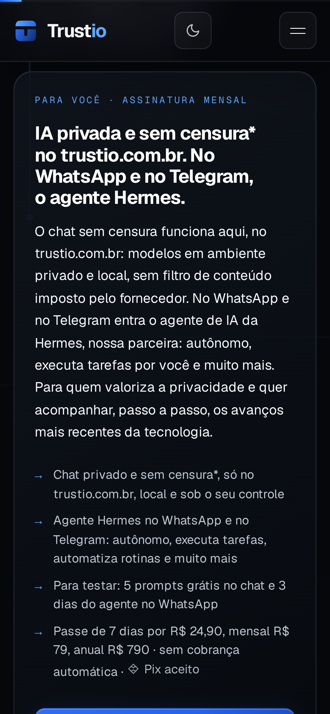

  Other captures: [J1-04-two-paths-desktop-light.png](./screenshots/J1-04-two-paths-desktop-light.png), [J1-04-two-paths-mobile-light.png](./screenshots/J1-04-two-paths-mobile-light.png), [J1-01-hero-full-desktop-dark.png](./screenshots/J1-01-hero-full-desktop-dark.png), [J1-01-hero-full-desktop-light.png](./screenshots/J1-01-hero-full-desktop-light.png), [J1-01-hero-full-mobile-dark.png](./screenshots/J1-01-hero-full-mobile-dark.png), [J1-01-hero-full-mobile-light.png](./screenshots/J1-01-hero-full-mobile-light.png)

**Step 05 — Scroll to 45% of the page** · `https://trustio.com.br/`

- Expected: Header stays reachable; a CTA is always one tap away
- Actual: Header is position:fixed (81 px desktop / 73 px mobile) and stays visible.
- Friction: **F08** (sev 1, observed)

 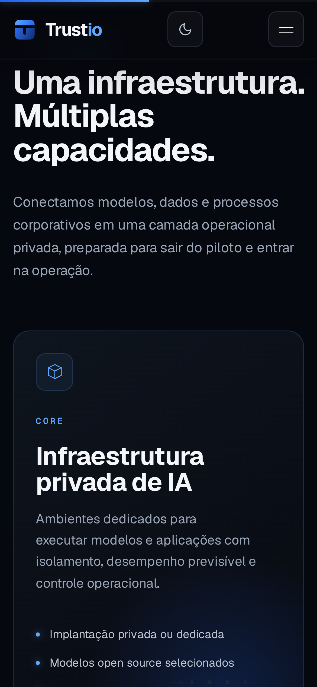

  Other captures: [J1-05-sticky-header-desktop-light.png](./screenshots/J1-05-sticky-header-desktop-light.png), [J1-05-sticky-header-mobile-light.png](./screenshots/J1-05-sticky-header-mobile-light.png), [J1-01-hero-full-desktop-dark.png](./screenshots/J1-01-hero-full-desktop-dark.png), [J1-01-hero-full-desktop-light.png](./screenshots/J1-01-hero-full-desktop-light.png), [J1-01-hero-full-mobile-dark.png](./screenshots/J1-01-hero-full-mobile-dark.png), [J1-01-hero-full-mobile-light.png](./screenshots/J1-01-hero-full-mobile-light.png)


### J2 · VoiceAI

Runs: desktop/dark, mobile/dark.

**Step 01 — Land on /voice.html** · `https://trustio.com.br/voice.html`

- Expected: Clear what the VoiceAI product does and how to try it
- Actual: Strong H1 and orb stage. Desktop: no CTA above the fold. Mobile: "Criar um agente assim ↗" visible.
- Friction: **F11** (sev 2, observed); **F12** (sev 2, observed); **F45** (sev 1, observed); **F46** (sev 2, observed)

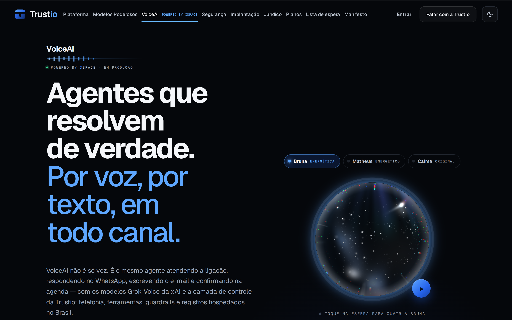 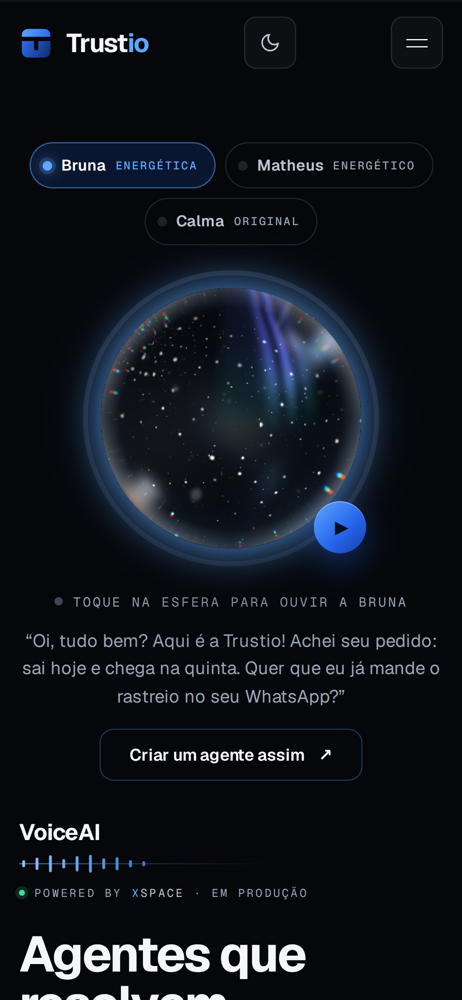

  Other captures: [J2-01-voice-hero-full-desktop-dark.png](./screenshots/J2-01-voice-hero-full-desktop-dark.png), [J2-01-voice-hero-full-mobile-dark.png](./screenshots/J2-01-voice-hero-full-mobile-dark.png)

**Step 02 — Observe the hero orb idle state** · `https://trustio.com.br/voice.html`

- Expected: Affordance says "tap to hear"; voice choices visible
- Actual: "Toque na esfera para ouvir a Bruna"; three voice chips; WebGL canvas renders.

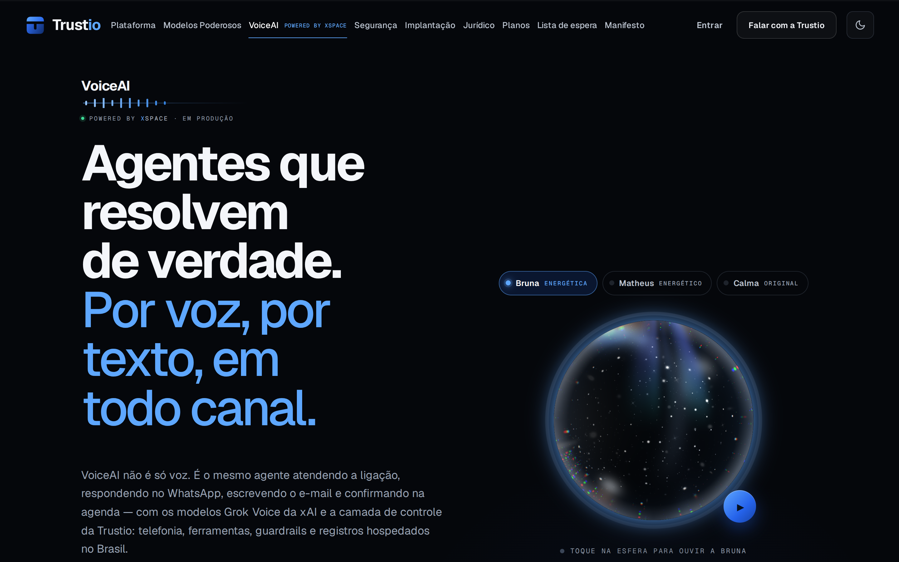 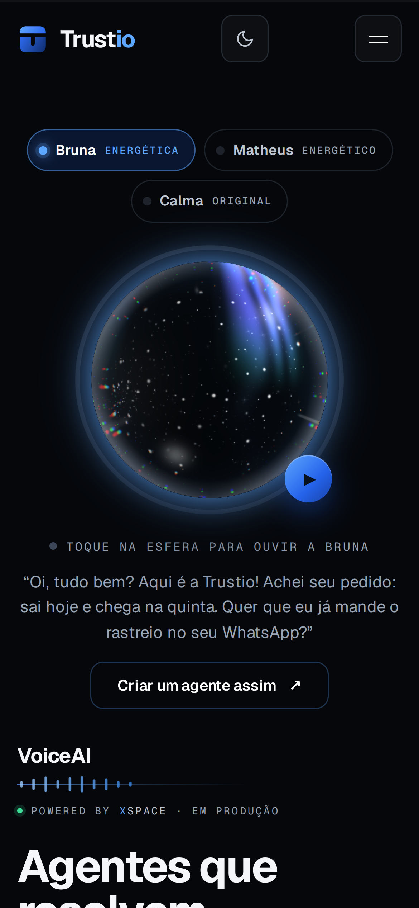

  Other captures: [J2-01-voice-hero-full-desktop-dark.png](./screenshots/J2-01-voice-hero-full-desktop-dark.png), [J2-01-voice-hero-full-mobile-dark.png](./screenshots/J2-01-voice-hero-full-mobile-dark.png)

**Step 03 — ONE click on the hero orb; observe first response for 3.5 s; session ended by closing the page** · `https://trustio.com.br/voice.html`

- Expected: Audio plays, live caption, visible progress
- Actual: Desktop: ONE click → "A Bruna falando…", live caption, aria-pressed=true; pre-recorded clip ends by itself. Mobile: stopped by guardrail (one interaction per demo).
- Guardrail: stopped by guardrail: one interaction per demo already used on desktop
- Friction: **F13** (sev 0, observed)

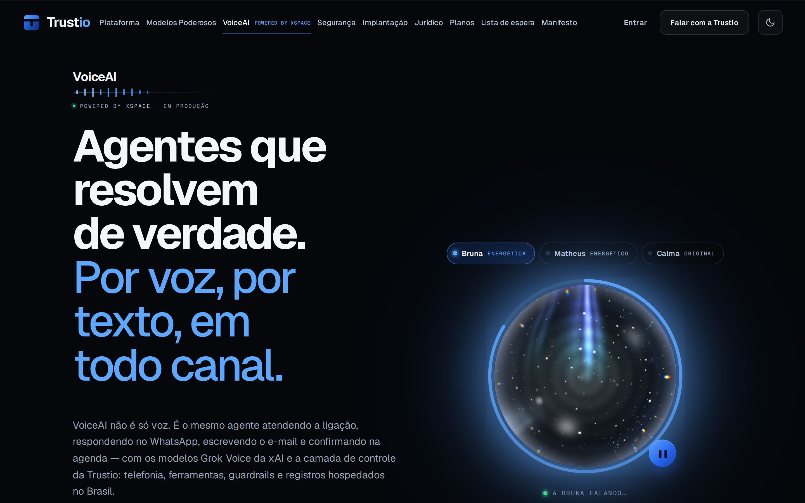 

  Other captures: [J2-01-voice-hero-full-desktop-dark.png](./screenshots/J2-01-voice-hero-full-desktop-dark.png), [J2-01-voice-hero-full-mobile-dark.png](./screenshots/J2-01-voice-hero-full-mobile-dark.png)

**Step 04 — Hover first channel card** · `https://trustio.com.br/voice.html`

- Expected: Cards read as interactive and reveal insight
- Actual: 8 channel cards (article + nested button); hover reveals insight on desktop; no tap on mobile (cards play audio).
- Friction: **F15** (sev 1, observed)

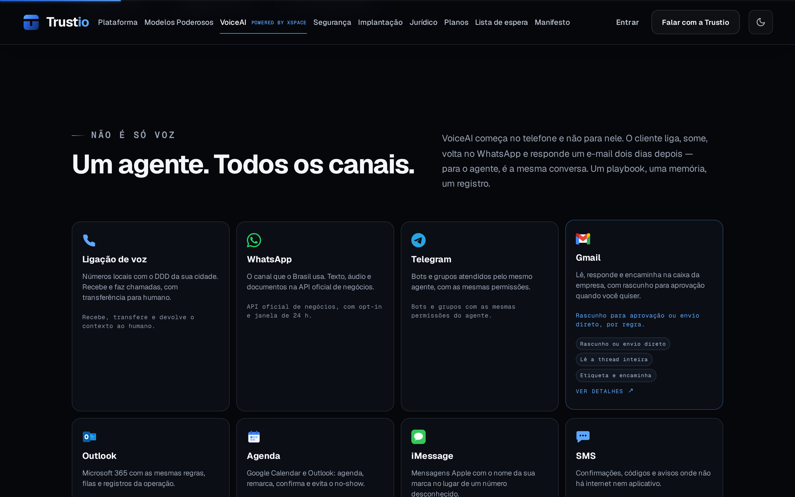 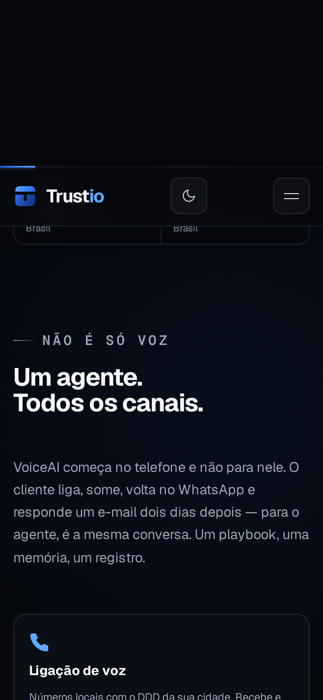

  Other captures: [J2-01-voice-hero-full-desktop-dark.png](./screenshots/J2-01-voice-hero-full-desktop-dark.png), [J2-01-voice-hero-full-mobile-dark.png](./screenshots/J2-01-voice-hero-full-mobile-dark.png)

**Step 05 — Open the "Chamada real" hand-off (screenshot only, no interaction)** · `https://voice.trustio.com.br/credito-jus`

- Expected: Live demo page loads
- Actual: voice.trustio.com.br does not resolve (no DNS record). The visitor gets a browser error page.
- Friction: **F10** (sev 4, observed)

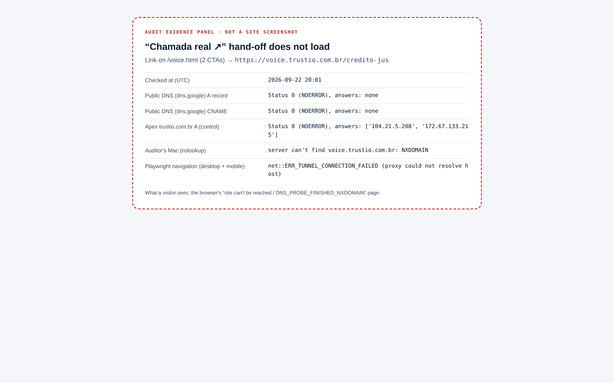 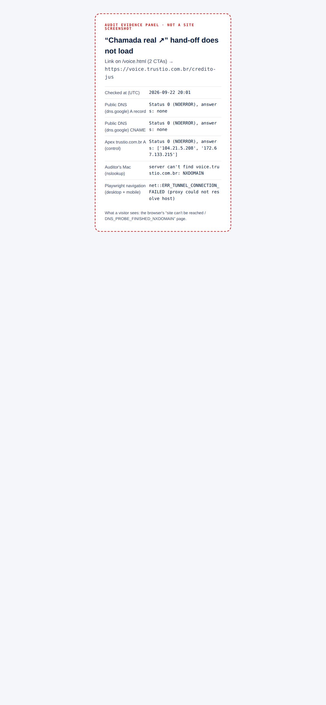

**Step 06 — Open "Construir meu agente" (/console/) — screenshot only** · `https://trustio.com.br/console/`

- Expected: Console or clear sign-up gate
- Actual: /console/ renders a polished demo console with production-looking metrics and a small "métricas ilustrativas" footnote.
- Friction: **F14** (sev 3, observed)

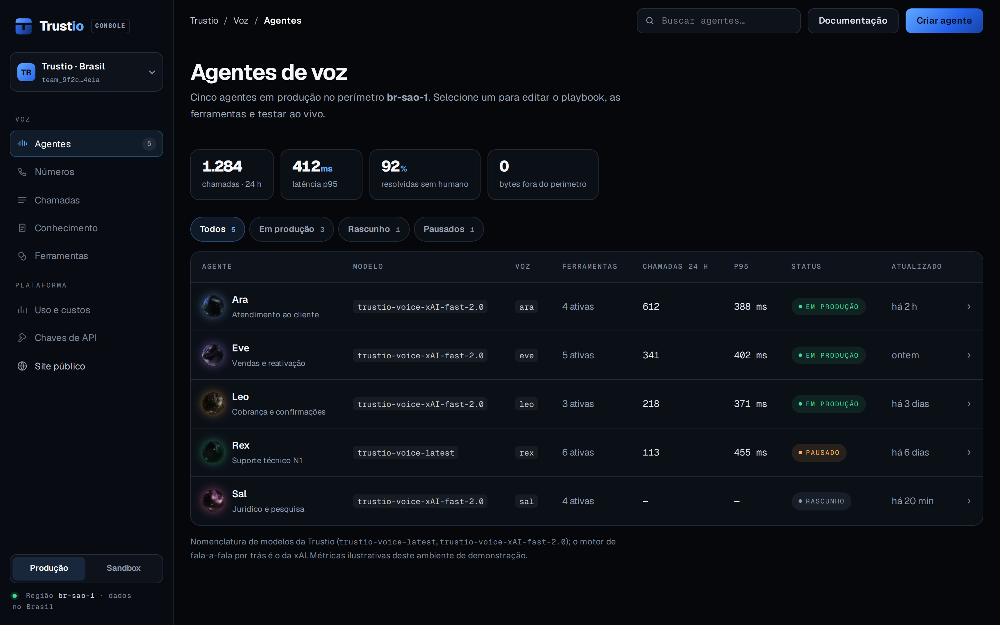 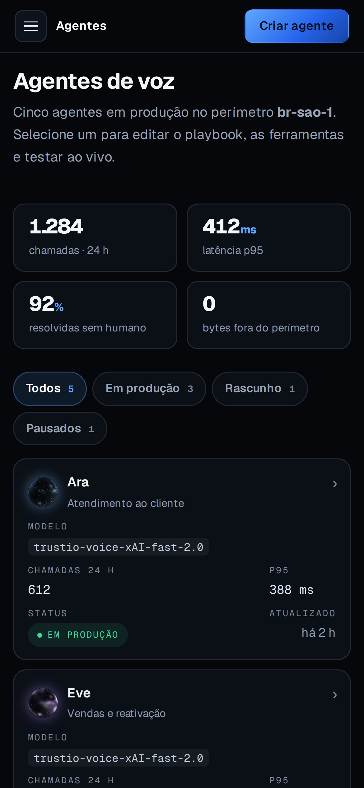

  Other captures: [J2-06-console-handoff-full-desktop-dark.png](./screenshots/J2-06-console-handoff-full-desktop-dark.png), [J2-06-console-handoff-full-mobile-dark.png](./screenshots/J2-06-console-handoff-full-mobile-dark.png)


### J3 · Plans & pricing (+ Stripe hand-off)

Runs: desktop/dark, desktop/light, mobile/dark, mobile/light.

**Step 01 — Land on /planos.html** · `https://trustio.com.br/planos.html`

- Expected: B2C vs B2B split obvious above the fold
- Actual: Opens on "Para empresas" (Starter R$ 2.900, Pro R$ 7.900, Dedicado R$ 19.900, Diagnóstico R$ 4.900). H1 "Contratada em minutos".
- Friction: **F16** (sev 2, observed)

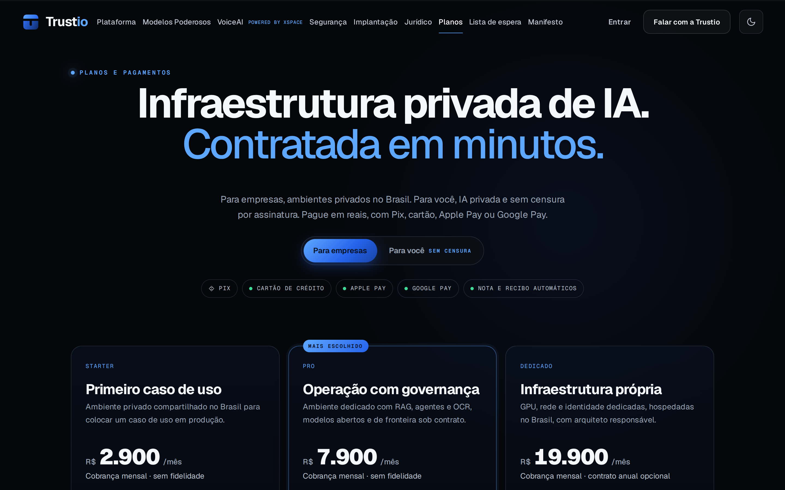 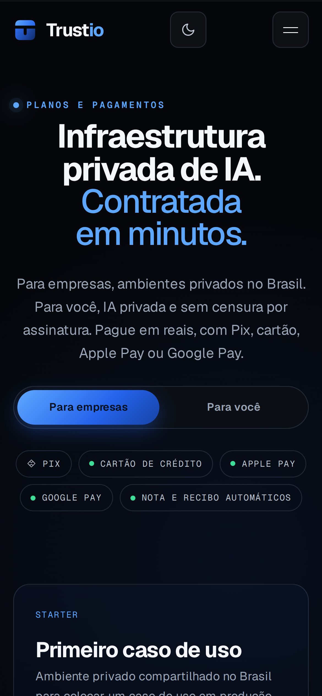

  Other captures: [J3-01-planos-desktop-light.png](./screenshots/J3-01-planos-desktop-light.png), [J3-01-planos-mobile-light.png](./screenshots/J3-01-planos-mobile-light.png), [J3-01-planos-full-desktop-dark.png](./screenshots/J3-01-planos-full-desktop-dark.png), [J3-01-planos-full-desktop-light.png](./screenshots/J3-01-planos-full-desktop-light.png), [J3-01-planos-full-mobile-dark.png](./screenshots/J3-01-planos-full-mobile-dark.png), [J3-01-planos-full-mobile-light.png](./screenshots/J3-01-planos-full-mobile-light.png)

**Step 02 — Click "Para você" (B2C)** · `https://trustio.com.br/planos.html#pessoal`

- Expected: B2C plans shown; monthly/7-day/annual comparable
- Actual: "Para você" tab: Mensal R$ 79 (Recomendado), Passe 7 dias R$ 24,90, Anual R$ 790 (≈ R$ 65,80/mês); each card also offers "Ou entrar na lista grátis ↓".
- Friction: **F21** (sev 1, observed)

 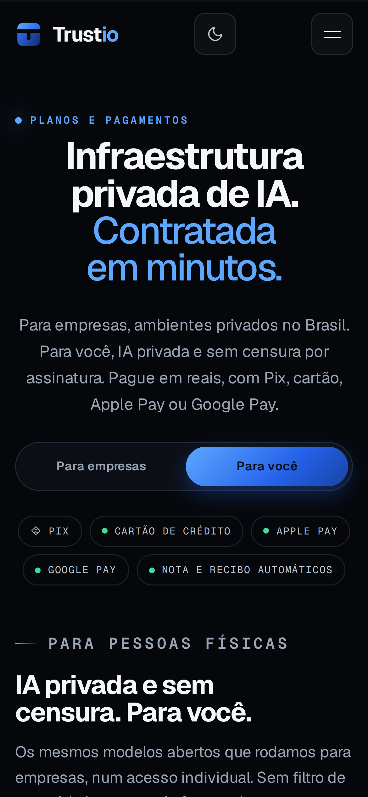

  Other captures: [J3-02-para-voce-desktop-light.png](./screenshots/J3-02-para-voce-desktop-light.png), [J3-02-para-voce-mobile-light.png](./screenshots/J3-02-para-voce-mobile-light.png), [J3-02-para-voce-full-desktop-dark.png](./screenshots/J3-02-para-voce-full-desktop-dark.png), [J3-02-para-voce-full-desktop-light.png](./screenshots/J3-02-para-voce-full-desktop-light.png), [J3-02-para-voce-full-mobile-dark.png](./screenshots/J3-02-para-voce-full-mobile-dark.png), [J3-02-para-voce-full-mobile-light.png](./screenshots/J3-02-para-voce-full-mobile-light.png)

**Step 03 — Read the early-access / state-of-today block** · `https://trustio.com.br/planos.html#pessoal`

- Expected: Dates 23/09 and 01/10 unambiguous; what you get today is explicit
- Actual: "Estado de hoje: cadastro aberto, chat ainda fechado. O chat abre em 1º de outubro… pré-assina… entra em 23 de setembro." Clear.
- Friction: **F23** (sev 0, observed)

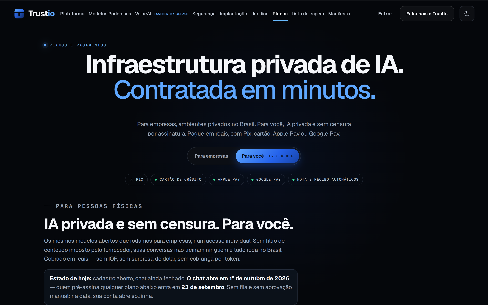 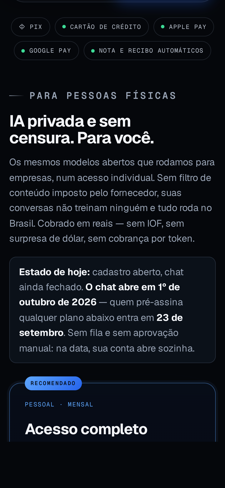

  Other captures: [J3-03-early-access-desktop-light.png](./screenshots/J3-03-early-access-desktop-light.png), [J3-03-early-access-mobile-light.png](./screenshots/J3-03-early-access-mobile-light.png), [J3-02-para-voce-full-desktop-dark.png](./screenshots/J3-02-para-voce-full-desktop-dark.png), [J3-02-para-voce-full-desktop-light.png](./screenshots/J3-02-para-voce-full-desktop-light.png), [J3-02-para-voce-full-mobile-dark.png](./screenshots/J3-02-para-voce-full-mobile-dark.png), [J3-02-para-voce-full-mobile-light.png](./screenshots/J3-02-para-voce-full-mobile-light.png)

**Step 04 — Scroll to "Comparativo · empresas" table** · `https://trustio.com.br/planos.html#empresas`

- Expected: Readable without horizontal scroll, or with a visible scroll cue
- Actual: Desktop: table fits. Mobile: 640 px table in a 358 px scroll box, no cue, not focusable.
- Friction: **F22** (sev 2, observed)

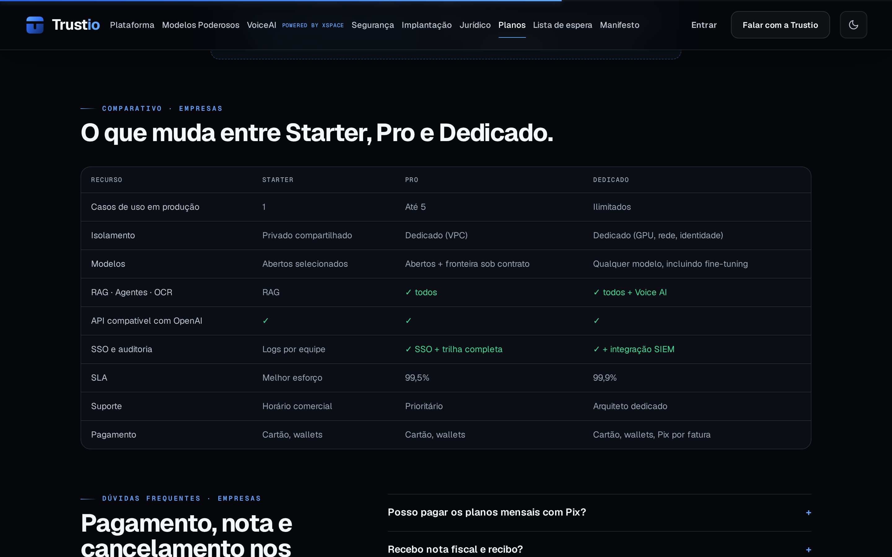 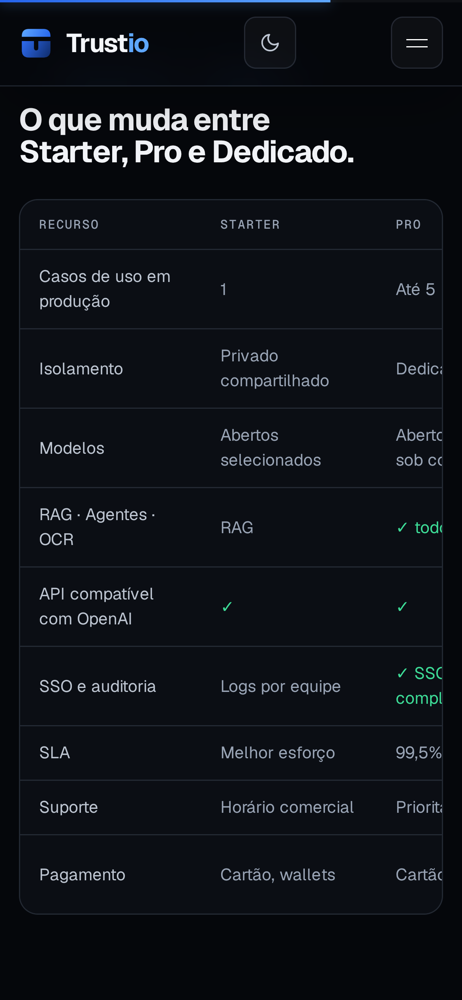

  Other captures: [J3-04-compare-table-desktop-light.png](./screenshots/J3-04-compare-table-desktop-light.png), [J3-04-compare-table-mobile-light.png](./screenshots/J3-04-compare-table-mobile-light.png), [J3-01-planos-full-desktop-dark.png](./screenshots/J3-01-planos-full-desktop-dark.png), [J3-01-planos-full-desktop-light.png](./screenshots/J3-01-planos-full-desktop-light.png), [J3-01-planos-full-mobile-dark.png](./screenshots/J3-01-planos-full-mobile-dark.png), [J3-01-planos-full-mobile-light.png](./screenshots/J3-01-planos-full-mobile-light.png)

**Step 05 — Stripe hand-off: Assinar Starter (desktop) · Pré-assinar · entrar em 23/09 (mobile)** · `https://buy.stripe.com/00wdR96Ia85pcmr6gL5wI05` · `https://buy.stripe.com/28EcN5aYq4Td9afgVp5wI08`

- Expected: Checkout shows Trustio branding, BRL price and the promised methods (Pix, Apple Pay, Google Pay)
- Actual: Stripe (each link opened once, page load only): merchant shown as JUICYSCORE, generic icon, crimson button, card only; B2B defaulted to USD from the audit network; Starter says "provisionado em até 5 dias úteis".
- Friction: **F18** (sev 3, observed); **F20** (sev 3, inferred)

 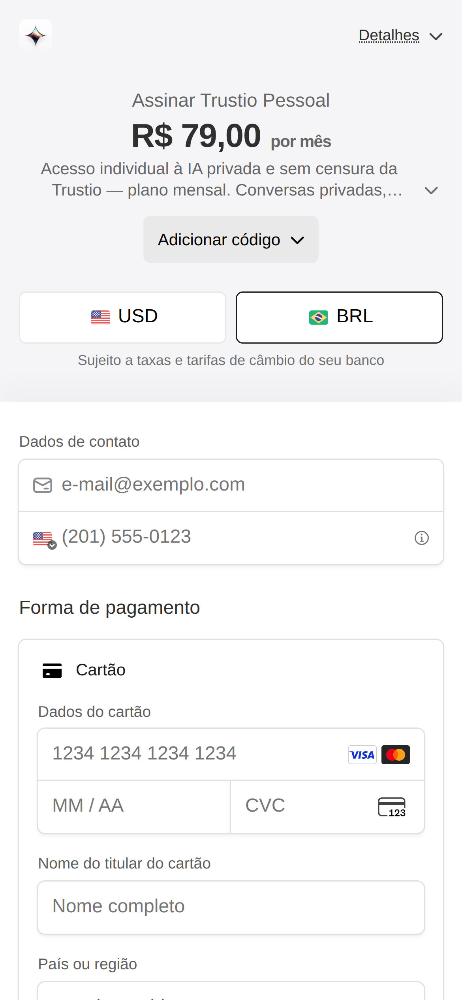

  Other captures: [J3-05-stripe-assinar-starter-full-desktop-dark.png](./screenshots/J3-05-stripe-assinar-starter-full-desktop-dark.png), [J3-05-stripe-pr-assinar-entrar-em-23-09-full-mobile-dark.png](./screenshots/J3-05-stripe-pr-assinar-entrar-em-23-09-full-mobile-dark.png)

**Step 06 — Stripe hand-off: Assinar Pro (desktop) · Comprar passe (mobile)** · `https://buy.stripe.com/aFa4gz1nQ71lbin0Wr5wI06` · `https://buy.stripe.com/8x228rgiKetN2LRfRl5wI09`

- Expected: Checkout shows Trustio branding, BRL price and the promised methods (Pix, Apple Pay, Google Pay)
- Actual: Stripe (each link opened once, page load only): merchant shown as JUICYSCORE, generic icon, crimson button, card only; B2B defaulted to USD from the audit network; Starter says "provisionado em até 5 dias úteis".
- Friction: **F19** (sev 2, observed)

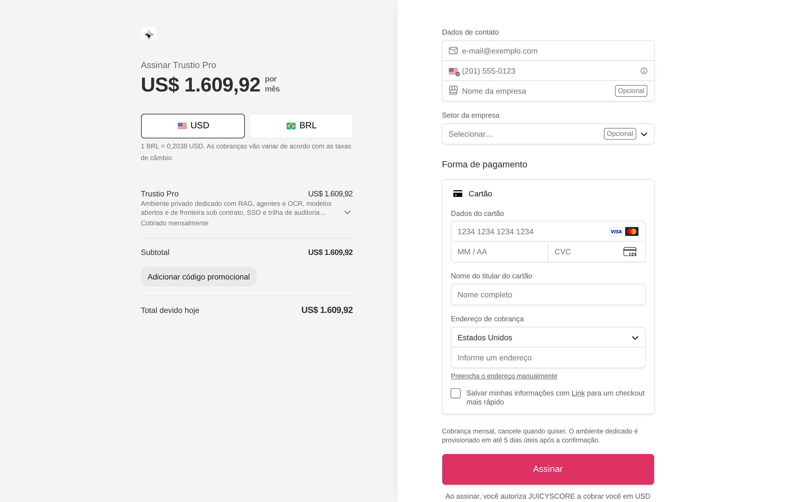 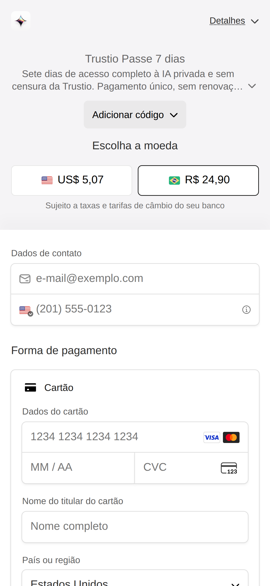

  Other captures: [J3-06-stripe-assinar-pro-full-desktop-dark.png](./screenshots/J3-06-stripe-assinar-pro-full-desktop-dark.png), [J3-06-stripe-comprar-passe-full-mobile-dark.png](./screenshots/J3-06-stripe-comprar-passe-full-mobile-dark.png)

**Step 07 — Stripe hand-off: Assinar Dedicado (desktop) · Pré-assinar · entrar em 23/09#2 (mobile)** · `https://buy.stripe.com/dRm3cvaYq2L59af34z5wI07` · `https://buy.stripe.com/cNifZhd6yfxR9afgVp5wI0a`

- Expected: Checkout shows Trustio branding, BRL price and the promised methods (Pix, Apple Pay, Google Pay)
- Actual: Stripe (each link opened once, page load only): merchant shown as JUICYSCORE, generic icon, crimson button, card only; B2B defaulted to USD from the audit network; Starter says "provisionado em até 5 dias úteis".

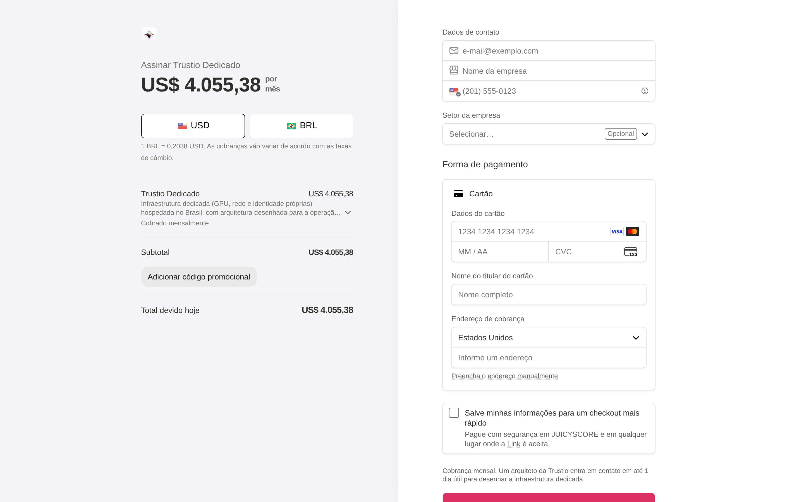 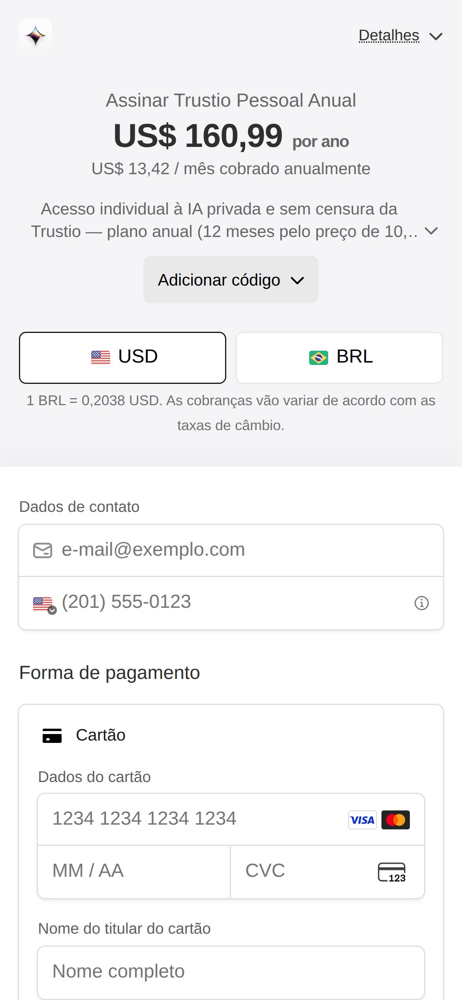

  Other captures: [J3-07-stripe-assinar-dedicado-full-desktop-dark.png](./screenshots/J3-07-stripe-assinar-dedicado-full-desktop-dark.png), [J3-07-stripe-pr-assinar-entrar-em-23-09-annual-full-mobile-dark.png](./screenshots/J3-07-stripe-pr-assinar-entrar-em-23-09-annual-full-mobile-dark.png)

**Step 08 — Stripe hand-off: Contratar diagnóstico (desktop)** · `https://buy.stripe.com/3cI4gz8Qi0CXdqv5cH5wI04`

- Expected: Checkout shows Trustio branding, BRL price and the promised methods (Pix, Apple Pay, Google Pay)
- Actual: Stripe (each link opened once, page load only): merchant shown as JUICYSCORE, generic icon, crimson button, card only; B2B defaulted to USD from the audit network; Starter says "provisionado em até 5 dias úteis".
- Friction: **F17** (sev 4, observed)

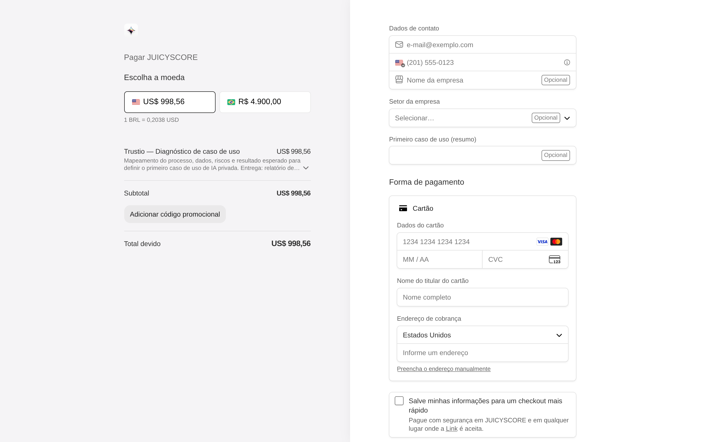

  Other captures: [J3-08-stripe-contratar-diagn-stico-full-desktop-dark.png](./screenshots/J3-08-stripe-contratar-diagn-stico-full-desktop-dark.png)

**Step 09 — Open /seats.html (individual offer page; in sitemap)** · `https://trustio.com.br/seats.html`

- Expected: Reachable from the home banner/nav; single clear CTA
- Actual: /seats.html: best B2C landing on the site (H1 + CTA + chips above the fold) but no inbound links; its nav anchors point to IDs that do not exist.
- Friction: **F24** (sev 3, observed)

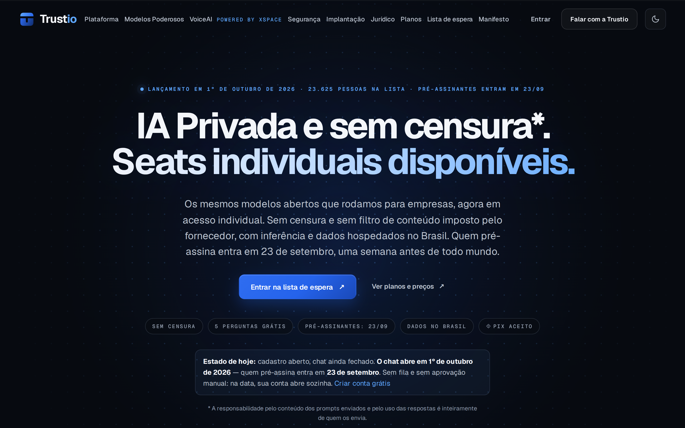 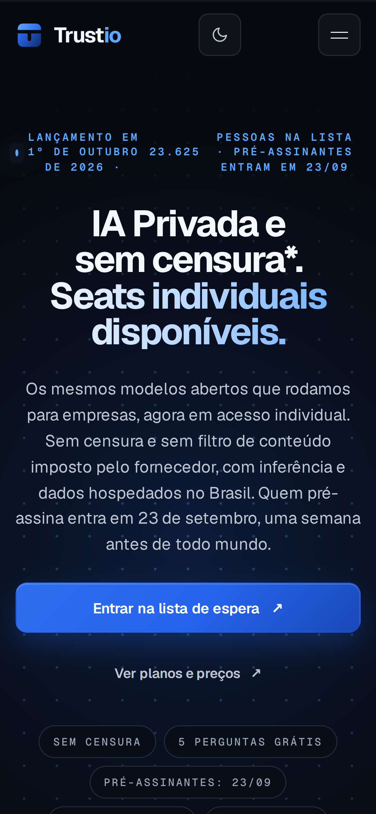

  Other captures: [J3-09-seats-full-desktop-dark.png](./screenshots/J3-09-seats-full-desktop-dark.png), [J3-09-seats-full-mobile-dark.png](./screenshots/J3-09-seats-full-mobile-dark.png)


### J4 · Waitlist & demo triggers

Runs: desktop/dark, mobile/dark.

**Step 01 — Land on /espera.html** · `https://trustio.com.br/espera.html`

- Expected: Purpose, benefit and effort ("30 segundos") clear; form visible
- Actual: Clear H1, status box, counter + countdown + 23/09 + "5 perguntas" tiles. Mobile: form ~2 screens down.
- Friction: **F27** (sev 2, observed)

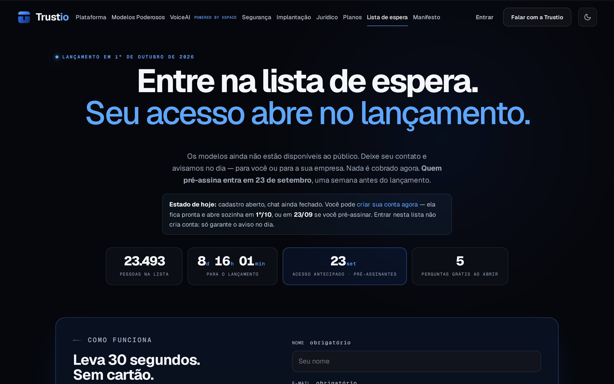 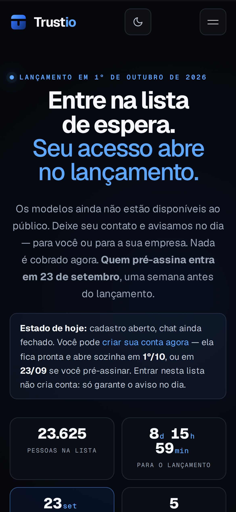

  Other captures: [J4-01-espera-full-desktop-dark.png](./screenshots/J4-01-espera-full-desktop-dark.png), [J4-01-espera-full-mobile-dark.png](./screenshots/J4-01-espera-full-mobile-dark.png)

**Step 02 — Tab through empty required fields; call reportValidity() (no submit)** · `https://trustio.com.br/espera.html`

- Expected: Inline, specific error messages next to fields
- Actual: Native bubbles only ("Please fill out this field." in this browser locale); no inline PT-BR errors.
- Friction: **F26** (sev 2, observed)

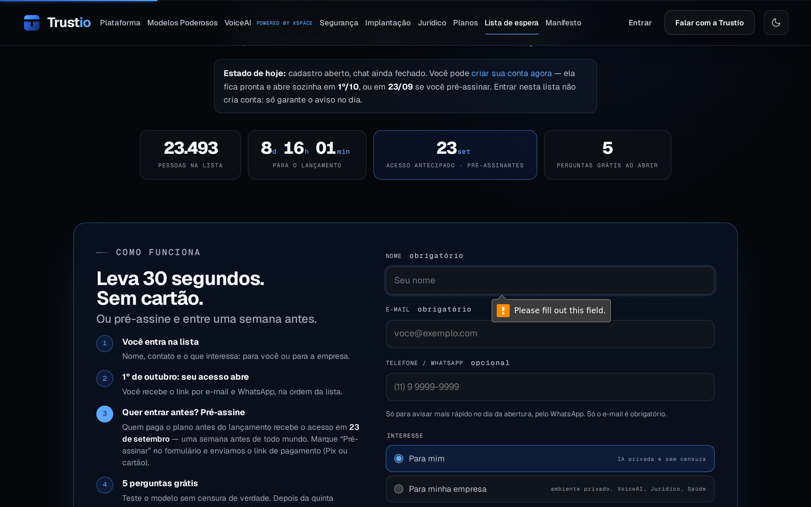 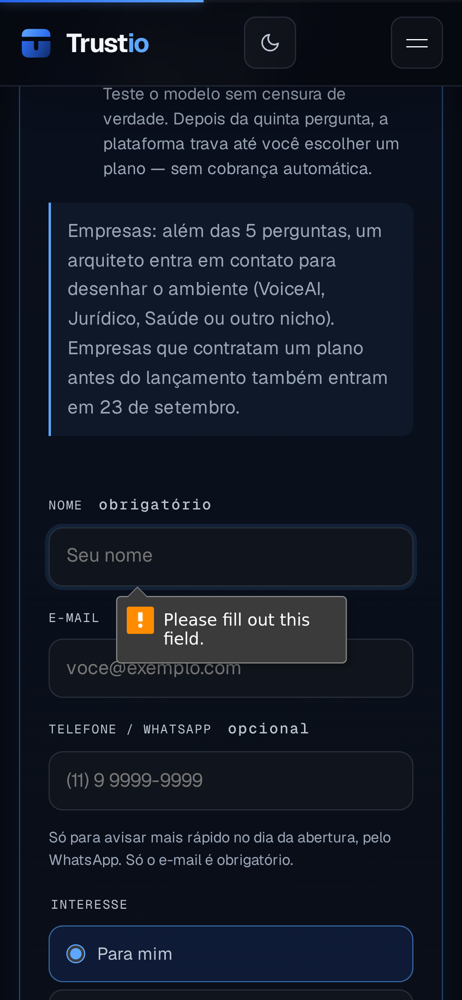

  Other captures: [J4-01-espera-full-desktop-dark.png](./screenshots/J4-01-espera-full-desktop-dark.png), [J4-01-espera-full-mobile-dark.png](./screenshots/J4-01-espera-full-mobile-dark.png)

**Step 03 — Type "Teste Auditoria" + invalid e-mail "teste@", move focus** · `https://trustio.com.br/espera.html`

- Expected: E-mail field flags the error on blur with guidance
- Actual: Invalid e-mail → pink border only; "NOME obrigatório" label vs "Só o e-mail é obrigatório" helper.
- Friction: **F25** (sev 2, observed); **F47** (sev 1, observed)

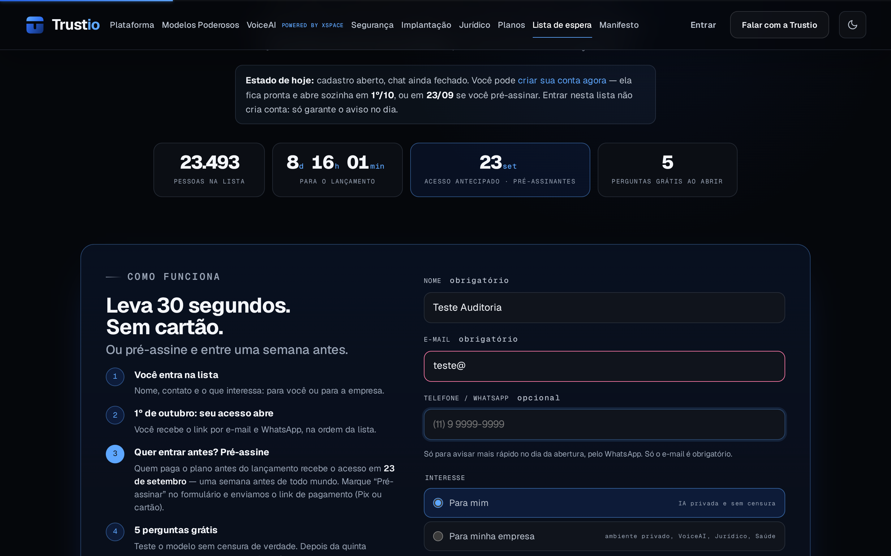 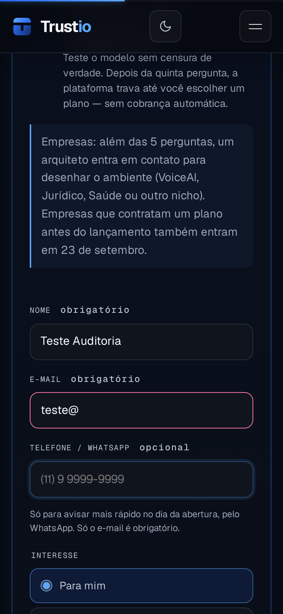

  Other captures: [J4-01-espera-full-desktop-dark.png](./screenshots/J4-01-espera-full-desktop-dark.png), [J4-01-espera-full-mobile-dark.png](./screenshots/J4-01-espera-full-mobile-dark.png)

**Step 04 — Type an incomplete phone "11"** · `https://trustio.com.br/espera.html`

- Expected: Mask or validation hint for Brazilian mobile
- Actual: Phone accepts "11" (no mask/pattern).

 

  Other captures: [J4-01-espera-full-desktop-dark.png](./screenshots/J4-01-espera-full-desktop-dark.png), [J4-01-espera-full-mobile-dark.png](./screenshots/J4-01-espera-full-mobile-dark.png)

**Step 05 — Choose "Para minha empresa"** · `https://trustio.com.br/espera.html`

- Expected: Segment appears and is clearly required; B2C-only choices hide
- Actual: "Para minha empresa" → Segmento (required, 8 verticals), Empresa, Tamanho. Works.
- Friction: **F30** (sev 0, observed)

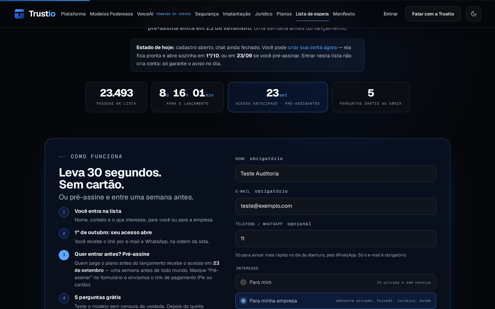 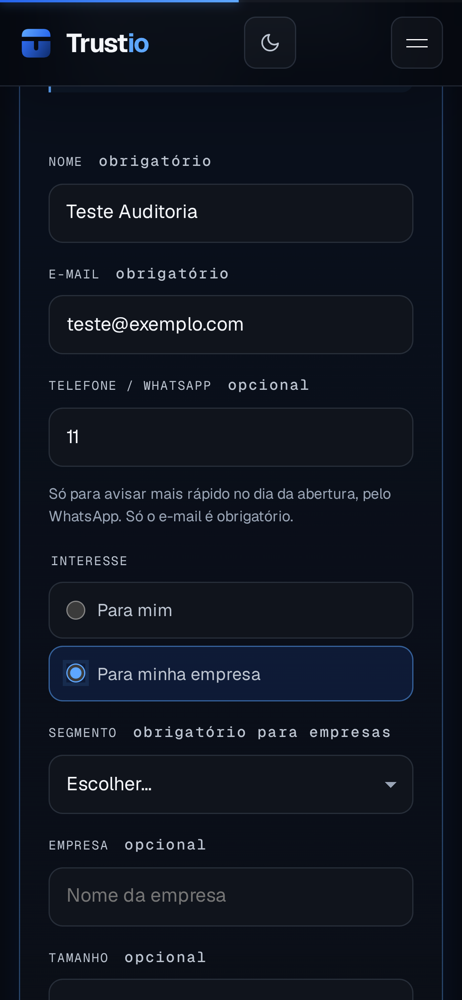

  Other captures: [J4-05-b2b-segment-full-desktop-dark.png](./screenshots/J4-05-b2b-segment-full-desktop-dark.png), [J4-05-b2b-segment-full-mobile-dark.png](./screenshots/J4-05-b2b-segment-full-mobile-dark.png)

**Step 06 — B2C + "Pré-assinar" with fake data; STOP — submit not clicked, Enter not pressed** · `https://trustio.com.br/espera.html`

- Expected: Clear what happens next (payment link by e-mail vs. direct checkout)
- Actual: B2C + "Pré-assinar": submit reads "Quero pré-assinar e entrar em 23/09 ↗" but the option says "enviamos o link de pagamento". STOPPED BY GUARDRAIL before submit.
- Guardrail: stopped by guardrail before submit
- Friction: **F28** (sev 3, observed)

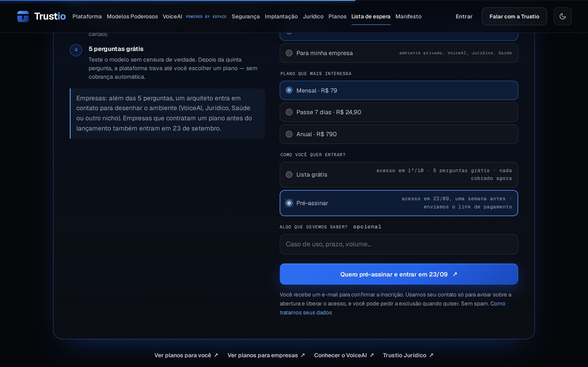 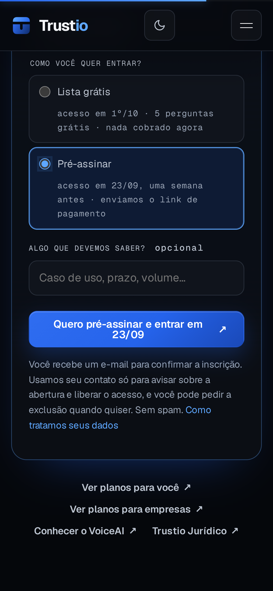

  Other captures: [J4-06-prefilled-stop-before-submit-full-desktop-dark.png](./screenshots/J4-06-prefilled-stop-before-submit-full-desktop-dark.png), [J4-06-prefilled-stop-before-submit-full-mobile-dark.png](./screenshots/J4-06-prefilled-stop-before-submit-full-mobile-dark.png)

**Step 07 — Waitlist form embedded on /planos.html** · `https://trustio.com.br/planos.html#espera-form`

- Expected: Same fields and promise as /espera.html
- Actual: Different embedded form on /planos (email, whatsapp, plano, acesso, uso).
- Friction: **F29** (sev 2, observed)

 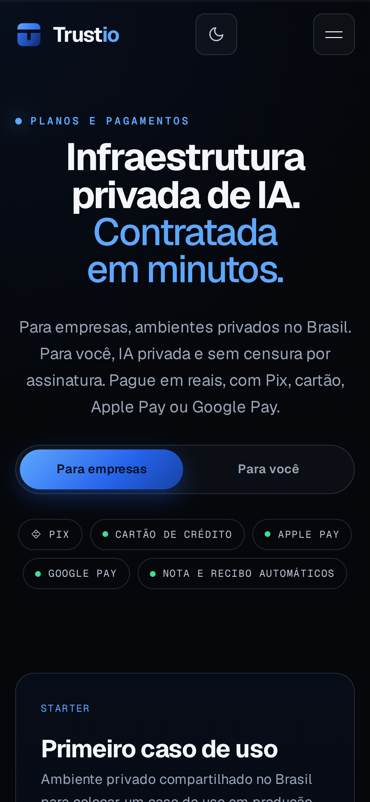

  Other captures: [J3-01-planos-full-desktop-dark.png](./screenshots/J3-01-planos-full-desktop-dark.png), [J3-01-planos-full-mobile-dark.png](./screenshots/J3-01-planos-full-mobile-dark.png)

**Step 08 — Follow "Falar com a Trustio" / "Falar com um arquiteto" (#contato)** · `https://trustio.com.br/#contato`

- Expected: A demo-booking path (form or scheduler) for B2B
- Actual: #contato: mailto only, "Sem formulários", "Respondemos em até 1 dia útil", Copiar button.
- Friction: **F31** (sev 3, observed)

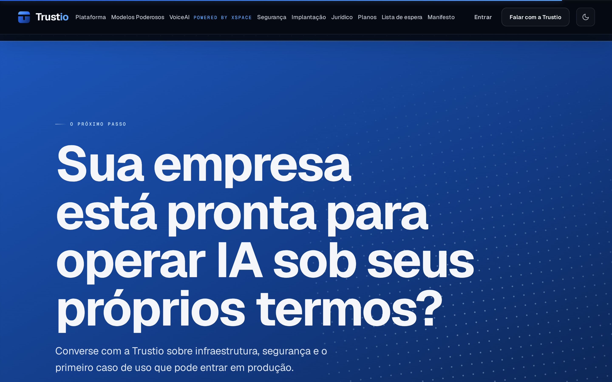 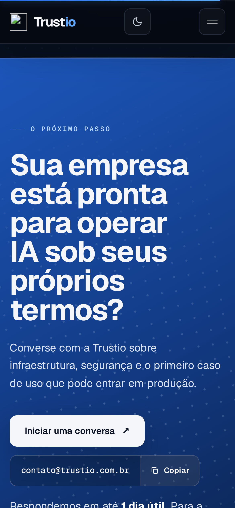

  Other captures: [J1-01-hero-full-desktop-dark.png](./screenshots/J1-01-hero-full-desktop-dark.png), [J1-01-hero-full-mobile-dark.png](./screenshots/J1-01-hero-full-mobile-dark.png)

**Step 09 — Open /cadastro.html (target of the home primary CTA) — observe only, no account created** · `https://trustio.com.br/cadastro.html`

- Expected: Relationship between "conta", "lista de espera" and "pré-assinatura" is explained
- Actual: Password sign-up; chat opens 1/10. Observed only (guardrail: no account creation).
- Guardrail: no login / no account creation
- Friction: **F32** (sev 2, observed)

 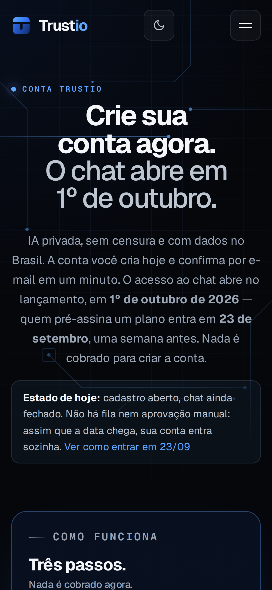

  Other captures: [J4-09-cadastro-full-desktop-dark.png](./screenshots/J4-09-cadastro-full-desktop-dark.png), [J4-09-cadastro-full-mobile-dark.png](./screenshots/J4-09-cadastro-full-mobile-dark.png)


### J5 · Trust & legal

Runs: desktop/dark, mobile/dark.

**Step 01 — Read juridico as a skeptical B2B buyer (P2)** · `https://trustio.com.br/juridico/`

- Expected: Claims are specific and verifiable (certificate id, issuer, CNPJ, DPO contact, sub-processors)
- Actual: /juridico/: strong vertical page; footer seals (ISO 27001, ANPD, LGPD).

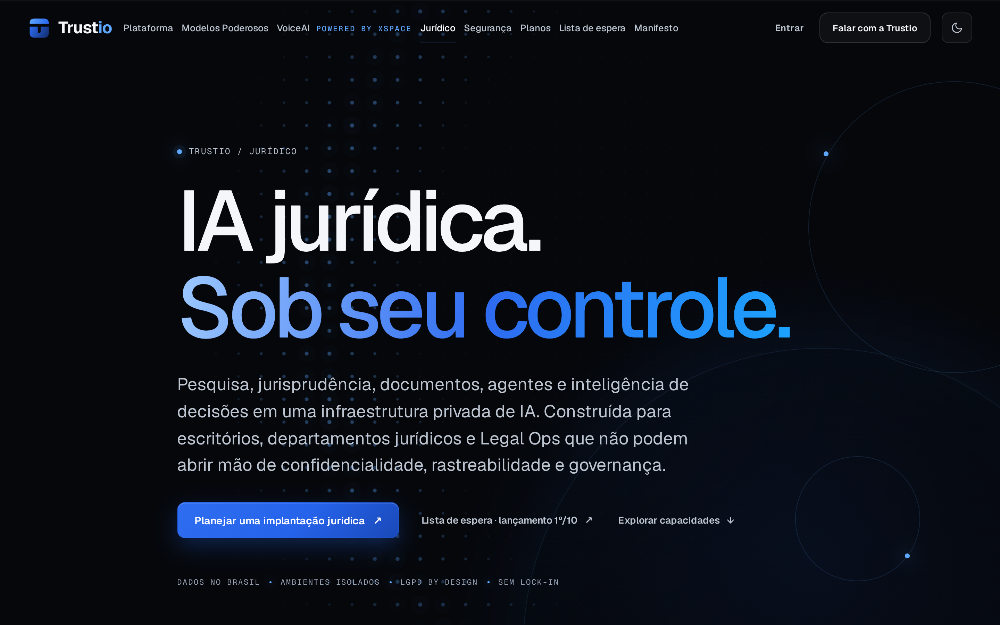 

  Other captures: [J5-01-juridico-full-desktop-dark.png](./screenshots/J5-01-juridico-full-desktop-dark.png), [J5-01-juridico-full-mobile-dark.png](./screenshots/J5-01-juridico-full-mobile-dark.png)

**Step 02 — Read manifesto as a skeptical B2B buyer (P2)** · `https://trustio.com.br/manifesto.html`

- Expected: Claims are specific and verifiable (certificate id, issuer, CNPJ, DPO contact, sub-processors)
- Actual: /manifesto: editorial; same footer seals.

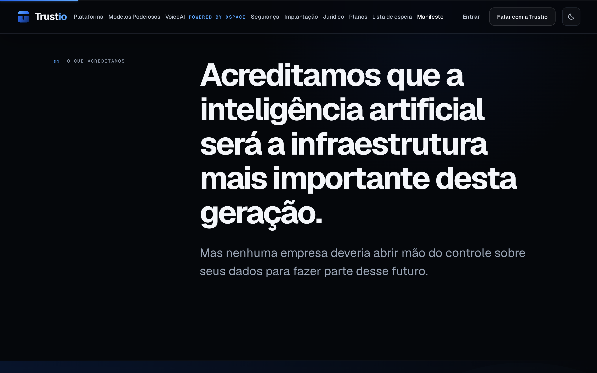 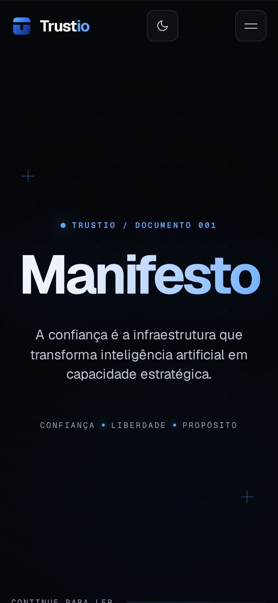

  Other captures: [J5-02-manifesto-full-desktop-dark.png](./screenshots/J5-02-manifesto-full-desktop-dark.png), [J5-02-manifesto-full-mobile-dark.png](./screenshots/J5-02-manifesto-full-mobile-dark.png)

**Step 03 — Read fundador as a skeptical B2B buyer (P2)** · `https://trustio.com.br/fundador.html`

- Expected: Claims are specific and verifiable (certificate id, issuer, CNPJ, DPO contact, sub-processors)
- Actual: /fundador: lists "ISO 27001, SOC 2 Type II e ISO 9001" under credentials.
- Friction: **F35** (sev 2, observed)

 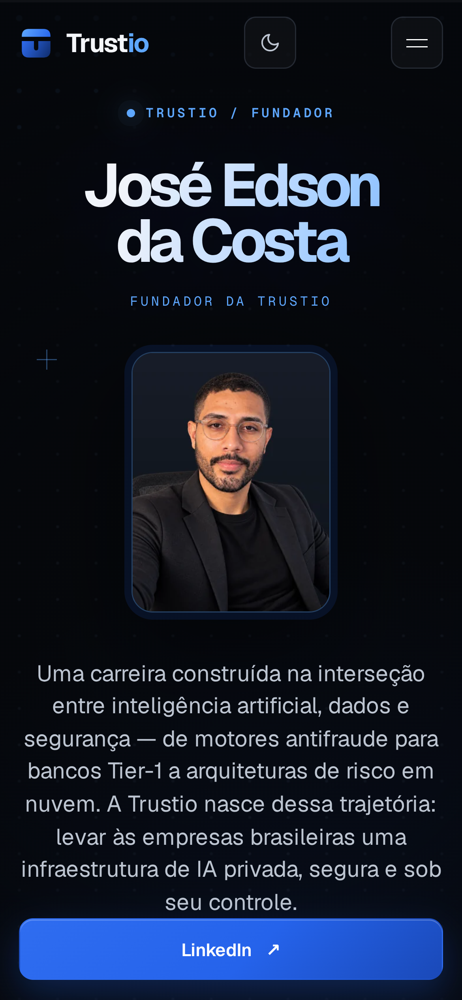

  Other captures: [J5-03-fundador-full-desktop-dark.png](./screenshots/J5-03-fundador-full-desktop-dark.png), [J5-03-fundador-full-mobile-dark.png](./screenshots/J5-03-fundador-full-mobile-dark.png)

**Step 04 — Read seguranca as a skeptical B2B buyer (P2)** · `https://trustio.com.br/#seguranca`

- Expected: Claims are specific and verifiable (certificate id, issuer, CNPJ, DPO contact, sub-processors)
- Actual: Home #seguranca: "Inferência, gravações e registros permanecem em infraestrutura nacional."
- Friction: **F38** (sev 2, inferred)

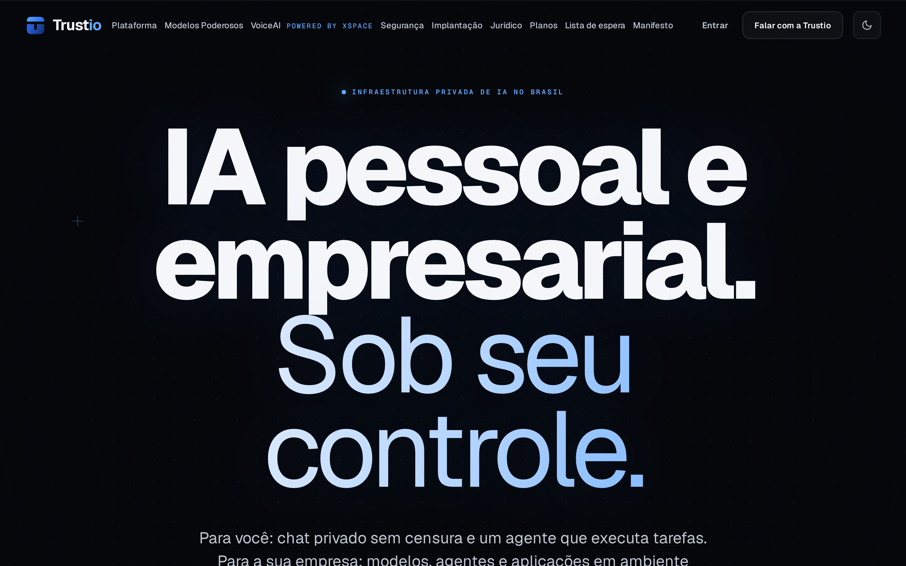 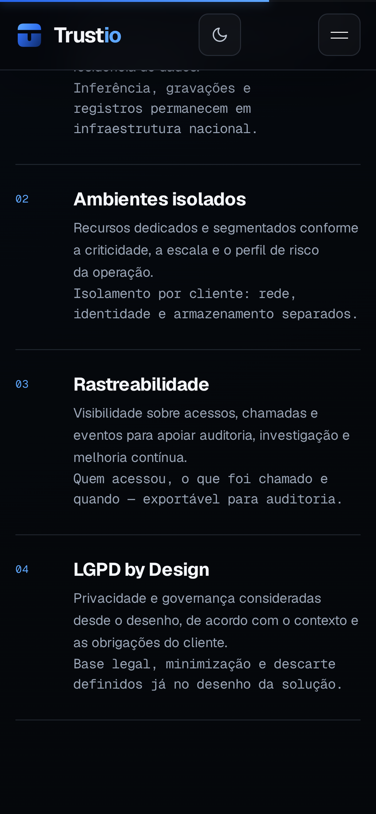

  Other captures: [J1-01-hero-full-desktop-dark.png](./screenshots/J1-01-hero-full-desktop-dark.png), [J1-01-hero-full-mobile-dark.png](./screenshots/J1-01-hero-full-mobile-dark.png)

**Step 05 — Read footer as a skeptical B2B buyer (P2)** · `https://trustio.com.br/`

- Expected: Claims are specific and verifiable (certificate id, issuer, CNPJ, DPO contact, sub-processors)
- Actual: Footer: "Certificação ISO 27001 · Conformidade LGPD", ISO/ANPD/LGPD images, no CNPJ/address/DPO.
- Friction: **F33** (sev 3, observed); **F34** (sev 3, observed); **F37** (sev 3, observed)

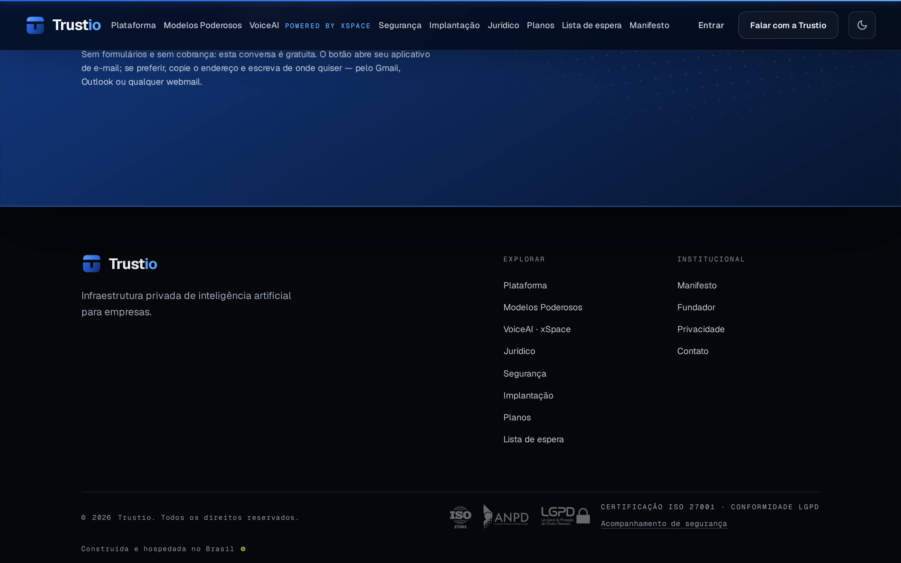 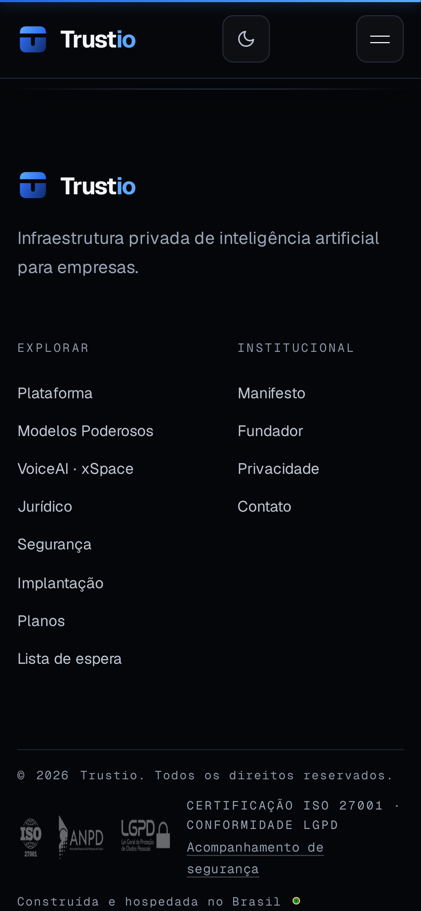

  Other captures: [J1-01-hero-full-desktop-dark.png](./screenshots/J1-01-hero-full-desktop-dark.png), [J1-01-hero-full-mobile-dark.png](./screenshots/J1-01-hero-full-mobile-dark.png)

**Step 06 — Read privacidade as a skeptical B2B buyer (P2)** · `https://trustio.com.br/privacidade.html`

- Expected: Claims are specific and verifiable (certificate id, issuer, CNPJ, DPO contact, sub-processors)
- Actual: Privacy policy: candid; B2C prompts go to a contracted LLM provider, country disclosed on request.
- Friction: **F36** (sev 4, observed); **F39** (sev 1, observed)

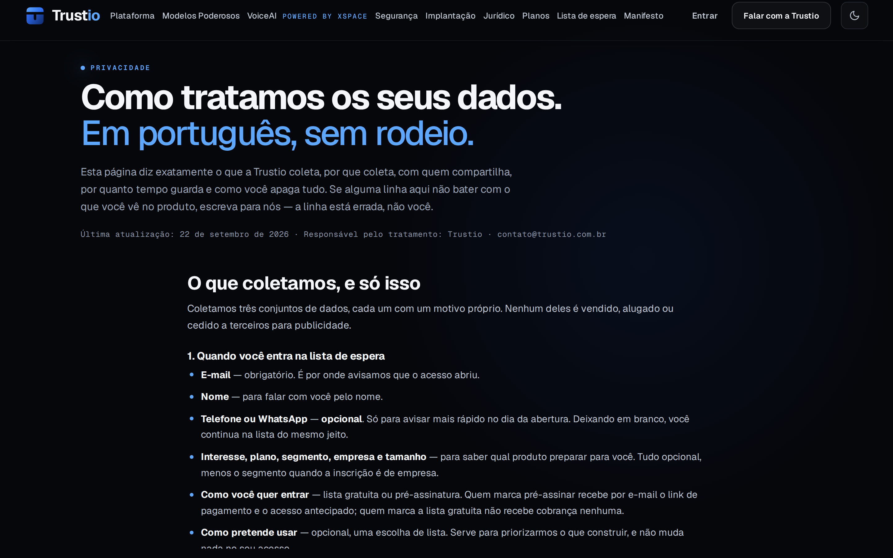 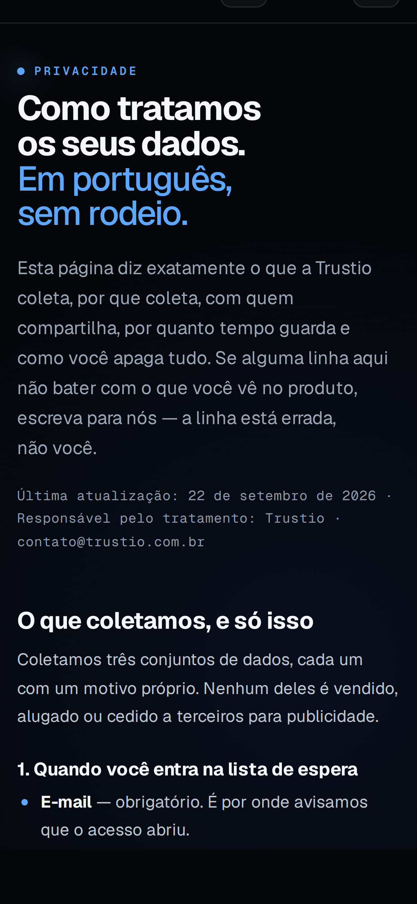

  Other captures: [J5-06-privacidade-full-desktop-dark.png](./screenshots/J5-06-privacidade-full-desktop-dark.png), [J5-06-privacidade-full-mobile-dark.png](./screenshots/J5-06-privacidade-full-mobile-dark.png)


### J6 · Mobile navigation (+ desktop keyboard)

Runs: desktop/dark, mobile/dark.

**Step 01 — Press Tab once** · `https://trustio.com.br/`

- Expected: Visible "skip to content" link
- Actual: Mobile header: logo, theme toggle, menu (44×44). Desktop: skip link visible on first Tab.
- Friction: **F43** (sev 0, observed)

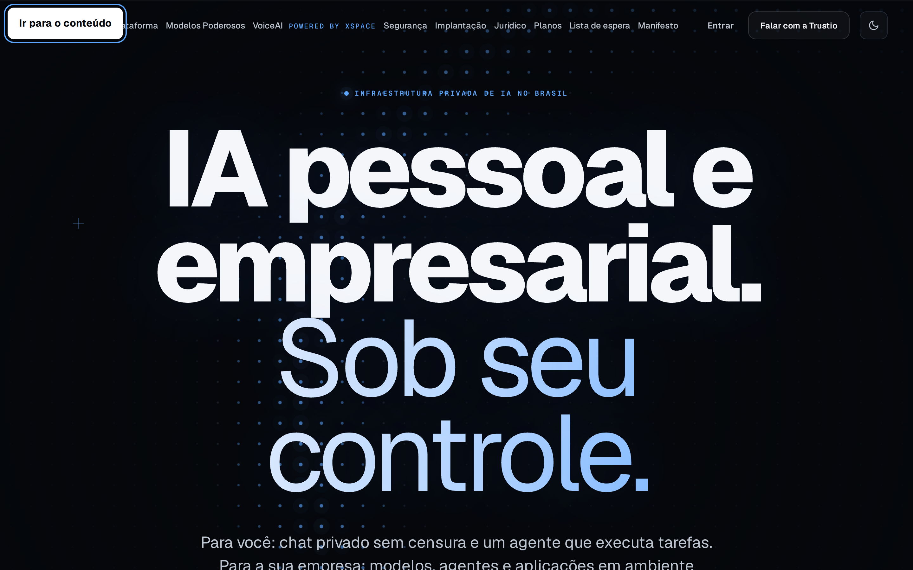 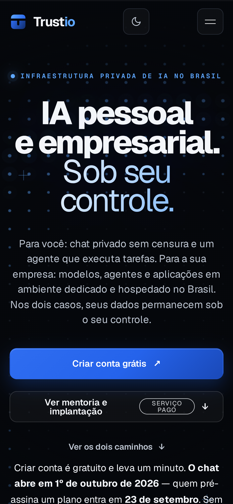

  Other captures: [J1-01-hero-full-desktop-dark.png](./screenshots/J1-01-hero-full-desktop-dark.png), [J1-01-hero-full-mobile-dark.png](./screenshots/J1-01-hero-full-mobile-dark.png)

**Step 02 — Tab ×16 through header and hero (no Enter pressed)** · `https://trustio.com.br/`

- Expected: Logical order; visible focus ring on every stop
- Actual: Mobile menu 885 px in an 844 px viewport; focus not moved in. Desktop: logical order, 2 px focus ring.
- Friction: **F40** (sev 2, observed)

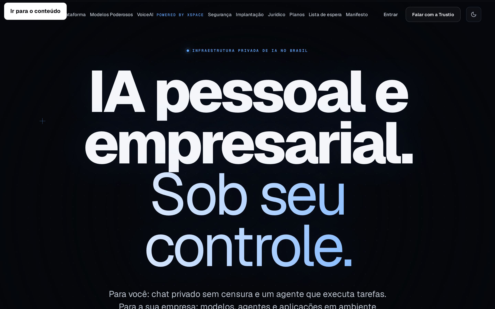 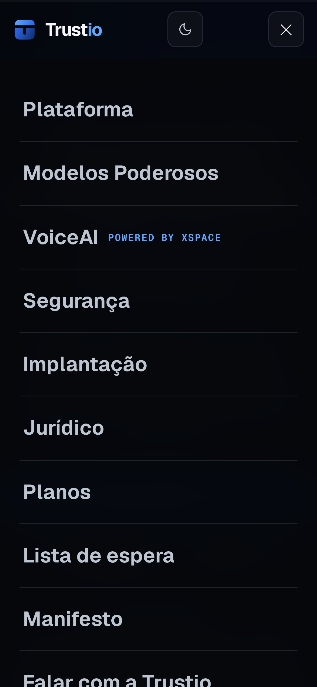

  Other captures: [J1-01-hero-full-desktop-dark.png](./screenshots/J1-01-hero-full-desktop-dark.png), [J6-02-menu-open-full-mobile-dark.png](./screenshots/J6-02-menu-open-full-mobile-dark.png)

**Step 03 — Press Escape with menu open** · `https://trustio.com.br/`

- Expected: Menu closes, focus returns to toggle
- Actual: Escape closes, focus returns to toggle.
- Friction: **F41** (sev 0, observed)

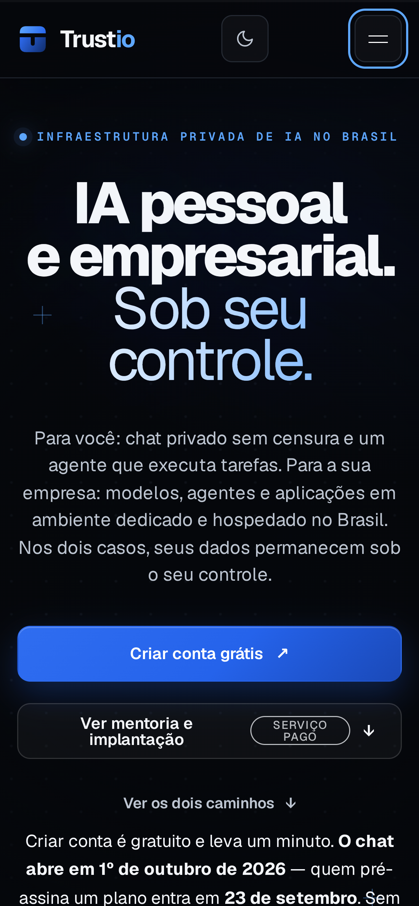

  Other captures: [J6-02-menu-open-full-mobile-dark.png](./screenshots/J6-02-menu-open-full-mobile-dark.png)

**Step 04 — Tap "Segurança" in the menu** · `https://trustio.com.br/#seguranca`

- Expected: Menu closes; section heading not hidden under sticky header
- Actual: Menu closes; section lands below sticky header.

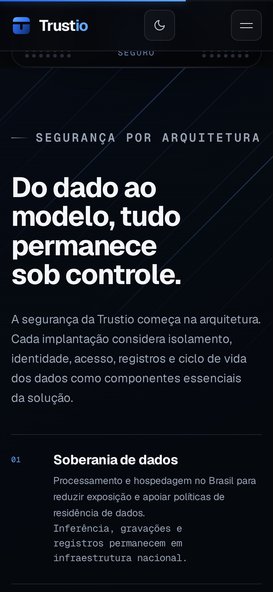

  Other captures: [J1-01-hero-full-mobile-dark.png](./screenshots/J1-01-hero-full-mobile-dark.png)

**Step 05 — Annotate tap targets (audit overlay: red <24 px, amber <44 px; inline text links excluded)** · `https://trustio.com.br/#seguranca`

- Expected: No non-inline target under 24×24 (WCAG 2.2 SC 2.5.8); ideally ≥44
- Actual: 12 footer links at 23 px height; header targets ≥ 44 px.
- Friction: **F42** (sev 1, observed)


  Other captures: [J6-05-tap-targets-annotated-full-mobile-dark.png](./screenshots/J6-05-tap-targets-annotated-full-mobile-dark.png)

**Step 06 — Check horizontal overflow on /planos.html** · `https://trustio.com.br/planos.html`

- Expected: No page-level horizontal scroll; wide tables contained with a cue
- Actual: No page-level horizontal scroll at 390 px on any page (scrollWidth = 390); wide tables scroll inside wrappers.

 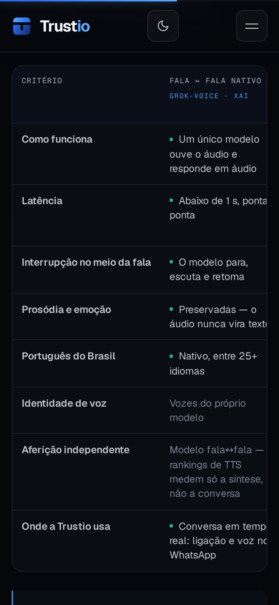

  Other captures: [J3-01-planos-full-mobile-dark.png](./screenshots/J3-01-planos-full-mobile-dark.png)


### 3.7 Consolidated friction log

(Also in `friction-log.csv`.)

| ID | Sev | Heuristic | O/I | Finding | Evidence | Rec |
|---|---|---|---|---|---|---|
| F01 | 3 | H8 | O | At 1440×900 the first viewport holds only the eyebrow and the H1 ("IA pessoal e empresarial. Sob seu controle."); the lead is cut mid-sentence and no CTA is visible (0 CTAs in viewport, measured). The first action a desktop visitor can take is in the 12-item header. | [J1-01-hero-desktop-dark.png](./screenshots/J1-01-hero-desktop-dark.png)<br>[J1-01-hero-desktop-light.png](./screenshots/J1-01-hero-desktop-light.png) | R03 |
| F02 | 2 | H2 | I | The hero speaks to two audiences in one sentence ("Para você: chat privado sem censura… Para a sua empresa: …"). P1 (mobile, social) has to parse B2B infrastructure language; P2 (law-firm partner / hospital IT) meets "sem censura" in the first read, a mixed signal for a compliance buyer. | [J1-01-hero-mobile-dark.png](./screenshots/J1-01-hero-mobile-dark.png)<br>[J1-01-hero-desktop-dark.png](./screenshots/J1-01-hero-desktop-dark.png) | R04 |
| F03 | 2 | H8 | O | Desktop header = 12 text links + theme toggle (13 targets). "VoiceAI POWERED BY XSPACE" mixes product and vendor branding inside the nav. Plataforma / Segurança / Implantação are in-page anchors of the home, so from any other page they reload the home. | [J1-03-nav-desktop-dark.png](./screenshots/J1-03-nav-desktop-dark.png)<br>[J1-03-nav-desktop-light.png](./screenshots/J1-03-nav-desktop-light.png) | R05 |
| F04 | 2 | H4 | O | The second banner ("IA Privada e sem censura*. Seats individuais disponíveis.") sends traffic to espera.html and planos.html#pessoal — not to /seats.html. The link inventory found zero inbound links to /seats.html anywhere on the site (only the sitemap lists it), although /seats.html is the clearest B2C landing (H1 + CTA above the fold). | [J1-02-second-banner-desktop-dark.png](./screenshots/J1-02-second-banner-desktop-dark.png)<br>[J1-02-second-banner-mobile-dark.png](./screenshots/J1-02-second-banner-mobile-dark.png)<br>[J3-09-seats-desktop-dark.png](./screenshots/J3-09-seats-desktop-dark.png) | R06 |
| F05 | 3 | H1 | O | Waitlist counter credibility — needs verification. assets/contador.js computes the number from the clock: 1.317 + 132 × (hours since 08/09 15:00 BRT ÷ 2). Every visitor sees the same value, and it jumped from 23.493 to 23.625 at exactly 20:00 UTC during this audit. The number is not substantiated by any visible source and reads as social proof. | [J1-02-second-banner-desktop-dark.png](./screenshots/J1-02-second-banner-desktop-dark.png)<br>[J4-01-espera-mobile-dark.png](./screenshots/J4-01-espera-mobile-dark.png)<br>[J3-09-seats-desktop-dark.png](./screenshots/J3-09-seats-desktop-dark.png) | R02 |
| F06 | 3 | H4 | O | Three parallel entry concepts compete from the first screen: "Criar conta grátis" (cadastro, account now, chat on 1/10), "Entrar na lista de espera" (no account), and "Pré-assinar" (Stripe, access 23/09). The CTA inventory shows 4 labels → cadastro, 3 → espera, 6 → Stripe and 9 → contact. The visitor must learn the difference between conta, lista and pré-assinatura before acting. | [J1-01-hero-mobile-dark.png](./screenshots/J1-01-hero-mobile-dark.png)<br>[J1-04-two-paths-desktop-dark.png](./screenshots/J1-04-two-paths-desktop-dark.png)<br>[J4-01-espera-desktop-dark.png](./screenshots/J4-01-espera-desktop-dark.png) | R01 |
| F07 | 1 | H8 | O | The home is 19,637 px tall on mobile (~23 screens) and 15,007 px on desktop. B2C, B2B platform, mentoring, principles, capabilities, security and implementation all live on one page. | [J1-01-hero-full-mobile-dark.png](./screenshots/J1-01-hero-full-mobile-dark.png)<br>[J1-01-hero-full-desktop-dark.png](./screenshots/J1-01-hero-full-desktop-dark.png) | R07 |
| F08 | 1 | H4 | O | The footer tagline on every page says "Infraestrutura privada de inteligência artificial para empresas", contradicting the dual B2C/B2B positioning of the hero. | [J5-05-footer-desktop-dark.png](./screenshots/J5-05-footer-desktop-dark.png) | R04 |
| F09 | 0 | — | O | Positive: the light theme toggle works (aria-pressed and aria-label switch, choice persisted in localStorage "trustio-theme"); measured text contrast in light theme passes AA (5.2–13.5:1). | [J1-01-hero-desktop-light.png](./screenshots/J1-01-hero-desktop-light.png)<br>[J1-01-hero-mobile-light.png](./screenshots/J1-01-hero-mobile-light.png) | — |
| F10 | 4 | H9 | O | "Chamada real ↗" (2 CTAs on /voice.html) points to voice.trustio.com.br/credito-jus, which has no DNS record (public DNS: NOERROR with no A/CNAME; auditor's Mac: NXDOMAIN). The most qualified B2B action on the page ends in a browser error. | [J2-05-handoff-dns-evidence-desktop-dark.png](./screenshots/J2-05-handoff-dns-evidence-desktop-dark.png)<br>[J2-05-handoff-dns-evidence-mobile-dark.png](./screenshots/J2-05-handoff-dns-evidence-mobile-dark.png) | R08 |
| F11 | 2 | H8 | O | On desktop the first viewport has no CTA (0 measured); the orb is the only interaction. On mobile "Criar um agente assim ↗" is visible, so the desktop layout under-serves the P2 persona who browses on a laptop. | [J2-01-voice-hero-desktop-dark.png](./screenshots/J2-01-voice-hero-desktop-dark.png)<br>[J2-01-voice-hero-mobile-dark.png](./screenshots/J2-01-voice-hero-mobile-dark.png) | R03 |
| F12 | 2 | H2 | O | "powered by xSpace · em produção" is unexplained. The body copy says the models are xAI's Grok Voice; a visitor cannot tell what xSpace is or whether a partnership exists (needs verification). "Em produção" is also unqualified (which customers, since when). | [J2-01-voice-hero-desktop-dark.png](./screenshots/J2-01-voice-hero-desktop-dark.png) | R09 |
| F13 | 0 | — | O | Positive: one click on the orb gives immediate feedback — state "A BRUNA FALANDO…", live word-by-word caption, aria-pressed=true, progress ring. The clip is pre-recorded and ends on its own. | [J2-03-orb-first-response-desktop-dark.png](./screenshots/J2-03-orb-first-response-desktop-dark.png)<br>[J2-02-orb-idle-desktop-dark.png](./screenshots/J2-02-orb-idle-desktop-dark.png) | — |
| F14 | 3 | H2 | O | "Construir meu agente" / "Criar um agente assim" / "Testar no Agent Builder" open /console/, which shows production-looking data (1.284 chamadas · 24 h, 92 % resolvidas sem humano, "Produção" selected, "EM PRODUÇÃO" badges). The only disclosure is a small footnote "Métricas ilustrativas deste ambiente de demonstração". Needs verification of framing. | [J2-06-console-handoff-desktop-dark.png](./screenshots/J2-06-console-handoff-desktop-dark.png)<br>[J2-06-console-handoff-mobile-dark.png](./screenshots/J2-06-console-handoff-mobile-dark.png) | R10 |
| F15 | 1 | H4 | O | Channel cards nest a <button> inside role="listitem" articles (axe aria-allowed-role, 8 nodes). The same card both reveals an insight on hover and plays audio on click, with no visual difference between the two affordances (inferred). | [J2-04-channel-cards-desktop-dark.png](./screenshots/J2-04-channel-cards-desktop-dark.png)<br>[J2-04-channel-cards-mobile-dark.png](./screenshots/J2-04-channel-cards-mobile-dark.png) | R16 |
| F16 | 2 | H2 | O | /planos opens on "Para empresas" with the H1 "Infraestrutura privada de IA. Contratada em minutos." A P1 visitor must find the "Para você" tab. The #pessoal deep link does select the B2C tab (verified), but only home links use it; the nav item "Planos" and the other pages open the B2B tab. | [J3-01-planos-mobile-dark.png](./screenshots/J3-01-planos-mobile-dark.png)<br>[J3-01-planos-desktop-dark.png](./screenshots/J3-01-planos-desktop-dark.png)<br>[J3-01-planos-desktop-light.png](./screenshots/J3-01-planos-desktop-light.png) | R11 |
| F17 | 4 | H4 | O | Stripe checkout does not look like Trustio. The Diagnóstico page is titled "Pagar JUICYSCORE", every checkout says "Pague com segurança em JUICYSCORE", and the B2C subscription mandate reads "Ao se inscrever, você autoriza a JUICYSCORE a cobrar de acordo com os termos até o cancelamento". The logo is a generic sparkle icon and the pay button is crimson (#DE3163). A buyer who clicked "Assinar" on Trustio sees another company's name at the moment of payment. The card statement descriptor probably shows the same name (inferred). | [J3-08-stripe-contratar-diagn-stico-desktop-dark.png](./screenshots/J3-08-stripe-contratar-diagn-stico-desktop-dark.png)<br>[J3-05-stripe-assinar-starter-desktop-dark.png](./screenshots/J3-05-stripe-assinar-starter-desktop-dark.png)<br>[J3-05-stripe-pr-assinar-entrar-em-23-09-full-mobile-dark.png](./screenshots/J3-05-stripe-pr-assinar-entrar-em-23-09-full-mobile-dark.png) | R12 |
| F18 | 3 | H4 | O | Delivery promises differ between site and checkout. The /planos H1 says "Contratada em minutos", but the Starter checkout says "O ambiente é provisionado em até 5 dias úteis após a confirmação". The site says "Sem fila e sem aprovação manual: na data, sua conta abre sozinha", but the Pessoal checkout says "depois, o acesso é liberado em até 1 dia útil". | [J3-05-stripe-assinar-starter-desktop-dark.png](./screenshots/J3-05-stripe-assinar-starter-desktop-dark.png)<br>[J3-05-stripe-pr-assinar-entrar-em-23-09-full-mobile-dark.png](./screenshots/J3-05-stripe-pr-assinar-entrar-em-23-09-full-mobile-dark.png)<br>[J3-01-planos-desktop-dark.png](./screenshots/J3-01-planos-desktop-dark.png) | R11 |
| F19 | 2 | H2 | O | From the audit network (not in Brazil) the B2B checkouts defaulted to USD (US$ 590,98 / 1.609,92 / 4.055,38) with "As cobranças vão variar de acordo com as taxas de câmbio" and billing country "Estados Unidos". /planos promises "Pague em reais… sem IOF, sem surpresa de dólar". This is likely Stripe geolocation; needs verification from a Brazilian IP. | [J3-06-stripe-assinar-pro-desktop-dark.png](./screenshots/J3-06-stripe-assinar-pro-desktop-dark.png)<br>[J3-07-stripe-assinar-dedicado-desktop-dark.png](./screenshots/J3-07-stripe-assinar-dedicado-desktop-dark.png) | R12 |
| F20 | 3 | H4 | I | All 7 checkout captures offered only "Cartão". The site promises Pix, Apple Pay and Google Pay ("PIX ACEITO" chip, method chips on /planos). Wallets cannot render in headless Chromium, and Pix requires BRL and Brazil, so this needs verification on a real Brazilian phone before 23/09. | [J3-05-stripe-pr-assinar-entrar-em-23-09-mobile-dark.png](./screenshots/J3-05-stripe-pr-assinar-entrar-em-23-09-mobile-dark.png)<br>[J3-06-stripe-comprar-passe-mobile-dark.png](./screenshots/J3-06-stripe-comprar-passe-mobile-dark.png)<br>[J3-02-para-voce-mobile-dark.png](./screenshots/J3-02-para-voce-mobile-dark.png) | R12 |
| F21 | 1 | H8 | O | B2C price anchoring is clear: monthly R$ 79 "Recomendado", 7-day pass R$ 24,90, annual R$ 790 "Dois meses grátis" (≈ R$ 65,80/mês). But every paid card also carries "Ou entrar na lista grátis ↓", which puts the free path inside each paid card the day before the 23/09 pre-sale. | [J3-02-para-voce-desktop-dark.png](./screenshots/J3-02-para-voce-desktop-dark.png)<br>[J3-02-para-voce-mobile-dark.png](./screenshots/J3-02-para-voce-mobile-dark.png) | R01 |
| F22 | 2 | H7 | O | On mobile the B2B comparison table (640 px) sits in a 358 px scroll wrapper with no scroll cue, and the wrapper is not keyboard-focusable (axe scrollable-region-focusable, serious). The same pattern appears on /modelos (778 px table). | [J3-04-compare-table-mobile-dark.png](./screenshots/J3-04-compare-table-mobile-dark.png)<br>[J6-06-overflow-planos-table-mobile-dark.png](./screenshots/J6-06-overflow-planos-table-mobile-dark.png)<br>[J6-06-overflow-modelos-table-mobile-dark.png](./screenshots/J6-06-overflow-modelos-table-mobile-dark.png) | R16 |
| F23 | 0 | H1 | O | Positive: the "Estado de hoje: cadastro aberto, chat ainda fechado…" block states both dates unambiguously. It is repeated almost verbatim on 5 pages, which is consistent but adds length. | [J3-03-early-access-desktop-dark.png](./screenshots/J3-03-early-access-desktop-dark.png)<br>[J3-03-early-access-mobile-light.png](./screenshots/J3-03-early-access-mobile-light.png) | — |
| F24 | 3 | H4 | O | On /seats.html the header anchors (#plataforma, #seguranca, #implantacao, #contato) point to IDs that do not exist on that page, so 4 nav items do nothing there. This was found by the link check (anchor MISSING). | [J3-09-seats-desktop-dark.png](./screenshots/J3-09-seats-desktop-dark.png)<br>[J3-09-seats-mobile-dark.png](./screenshots/J3-09-seats-mobile-dark.png) | R06 |
| F25 | 2 | H4 | O | Contradictory microcopy: the label reads "NOME obrigatório", while the helper under the phone field says "Só o e-mail é obrigatório". The name field is required in the markup. | [J4-03-invalid-email-mobile-dark.png](./screenshots/J4-03-invalid-email-mobile-dark.png)<br>[J4-03-invalid-email-desktop-dark.png](./screenshots/J4-03-invalid-email-desktop-dark.png) | R13 |
| F26 | 2 | H9 | O | Validation relies on native browser bubbles, whose language follows the browser, not the page. An invalid e-mail ("teste@") only turns the border pink (#FF7AA8), with no text, no aria-invalid and no aria-describedby. The phone field accepts "11" (no mask or pattern). | [J4-02-empty-validation-desktop-dark.png](./screenshots/J4-02-empty-validation-desktop-dark.png)<br>[J4-03-invalid-email-desktop-dark.png](./screenshots/J4-03-invalid-email-desktop-dark.png)<br>[J4-03-invalid-email-mobile-dark.png](./screenshots/J4-03-invalid-email-mobile-dark.png) | R13 |
| F27 | 2 | H8 | O | On mobile the first field appears about 2 screens below the fold, after the status box, 4 stat tiles and a 4-step explainer. The first viewport contains no field and no button. | [J4-01-espera-mobile-dark.png](./screenshots/J4-01-espera-mobile-dark.png)<br>[J4-01-espera-full-mobile-dark.png](./screenshots/J4-01-espera-full-mobile-dark.png) | R13 |
| F28 | 3 | H4 | O | In the waitlist form, "Pré-assinar" means "enviamos o link de pagamento" (by e-mail, later), while /planos has instant Stripe links. Two pre-sale paths with different latency exist the day before the 23/09 early-access date. The submit label "Quero pré-assinar e entrar em 23/09 ↗" implies immediate payment. Stopped by guardrail before submit. | [J4-06-prefilled-stop-before-submit-desktop-dark.png](./screenshots/J4-06-prefilled-stop-before-submit-desktop-dark.png)<br>[J4-06-prefilled-stop-before-submit-mobile-dark.png](./screenshots/J4-06-prefilled-stop-before-submit-mobile-dark.png) | R01 |
| F29 | 2 | H4 | O | /planos embeds a different waitlist form (email, whatsapp, plano, acesso, uso) from /espera (nome, email, telefone, tipo, segmento, empresa, tamanho, acesso, observacao), with the same id="espera-form". The same promise yields different lead data depending on the page. | [J4-07-planos-embedded-waitlist-desktop-dark.png](./screenshots/J4-07-planos-embedded-waitlist-desktop-dark.png)<br>[J4-07-planos-embedded-waitlist-mobile-dark.png](./screenshots/J4-07-planos-embedded-waitlist-mobile-dark.png) | R13 |
| F30 | 0 | — | O | Positive: choosing "Para minha empresa" reveals Segmento (required, 8 verticals incl. Jurídico and Saúde), Empresa and Tamanho, and hides the B2C plan radios. The B2C/B2B segmentation is clear. | [J4-05-b2b-segment-desktop-dark.png](./screenshots/J4-05-b2b-segment-desktop-dark.png)<br>[J4-05-b2b-segment-mobile-dark.png](./screenshots/J4-05-b2b-segment-mobile-dark.png) | — |
| F31 | 3 | H7 | O | Every B2B "demo" trigger (9 labels: "Falar com um arquiteto", "Planejar a implantação…", "Ativar este canal"…) resolves to a mailto: link. The section says "Sem formulários". There is no scheduler and no security pack. mailto: does nothing on machines without a mail client; the "Copiar" button mitigates this (impact inferred). | [J4-08-contato-demo-desktop-dark.png](./screenshots/J4-08-contato-demo-desktop-dark.png)<br>[J4-08-contato-demo-mobile-dark.png](./screenshots/J4-08-contato-demo-mobile-dark.png) | R14 |
| F32 | 2 | H2 | O | The home primary CTA "Criar conta grátis" opens a password sign-up (account now, chat on 1/10). This adds a third concept ("conta") next to lista and pré-assinatura. Observed only; no account was created. | [J4-09-cadastro-mobile-dark.png](./screenshots/J4-09-cadastro-mobile-dark.png)<br>[J4-09-cadastro-desktop-dark.png](./screenshots/J4-09-cadastro-desktop-dark.png) | R01 |
| F33 | 3 | H4 | O | Needs verification: the footer of every page claims "Certificação ISO 27001" with an ISO seal, but gives no certificate number, issuer, scope or verification link. The seal is not linked. | [J5-05-footer-desktop-dark.png](./screenshots/J5-05-footer-desktop-dark.png)<br>[J5-05-footer-mobile-dark.png](./screenshots/J5-05-footer-mobile-dark.png) | R15 |
| F34 | 3 | H4 | O | Needs verification: the ANPD logo is shown among the seals. ANPD is the data-protection regulator and does not certify companies, so the logo can read as an endorsement. Legal review recommended. | [J5-05-footer-desktop-dark.png](./screenshots/J5-05-footer-desktop-dark.png) | R15 |
| F35 | 2 | H2 | O | Needs verification: /fundador lists "ISO 27001, SOC 2 Type II e ISO 9001" under "Credenciais que sustentam a confiança". It is ambiguous whether these are personal qualifications or company certifications. | [J5-03-fundador-full-desktop-dark.png](./screenshots/J5-03-fundador-full-desktop-dark.png)<br>[J5-03-fundador-desktop-dark.png](./screenshots/J5-03-fundador-desktop-dark.png) | R15 |
| F36 | 4 | H4 | O | Data-residency claims contradict the privacy policy. Marketing says "tudo roda no Brasil" (/planos B2C), "inferência e dados hospedados no Brasil" (/seats) and "Inferência, gravações e registros permanecem em infraestrutura nacional" (home #seguranca). The privacy policy says B2C prompts go to a contracted LLM provider whose country is disclosed only on request and "se o provedor processar fora do Brasil, isso caracteriza transferência internacional". This affects the "Dados no Brasil" pillar directly. | [J5-06-privacidade-full-desktop-dark.png](./screenshots/J5-06-privacidade-full-desktop-dark.png)<br>[J3-03-early-access-desktop-dark.png](./screenshots/J3-03-early-access-desktop-dark.png)<br>[J5-04-seguranca-desktop-dark.png](./screenshots/J5-04-seguranca-desktop-dark.png) | R17 |
| F37 | 3 | H10 | O | A text search of the footer, /planos and /privacidade found no legal entity identity (razão social, CNPJ, address) and no named Encarregado (DPO). A paid offer is live. Legal verification recommended (e-commerce disclosure and LGPD Encarregado disclosure). | [J5-05-footer-desktop-dark.png](./screenshots/J5-05-footer-desktop-dark.png)<br>[J5-06-privacidade-full-desktop-dark.png](./screenshots/J5-06-privacidade-full-desktop-dark.png) | R18 |
| F38 | 2 | H10 | I | For P2, the security section is prose plus principles. It offers no downloadable security pack (architecture diagram, subprocessors, DPA, retention, pen-test summary) and no verifiable artefacts, so a hospital IT lead cannot complete a vendor assessment from the site. | [J5-04-seguranca-desktop-dark.png](./screenshots/J5-04-seguranca-desktop-dark.png)<br>[J5-04-seguranca-mobile-dark.png](./screenshots/J5-04-seguranca-mobile-dark.png) | R14 |
| F39 | 1 | H2 | O | The privacy policy is plain-language and candid (e.g. "Administradores da Trustio conseguem acessar conversas para suporte e para investigar abuso"). Marketing pages present "Privada" without this nuance. | [J5-06-privacidade-desktop-dark.png](./screenshots/J5-06-privacidade-desktop-dark.png) | R17 |
| F40 | 2 | H8 | O | The mobile menu has 11 items × 78 px = 885 px inside an 844 px viewport, so "Entrar" falls below the menu fold. Focus stays on the toggle when the menu opens (focus not moved into the dialog). | [J6-02-menu-open-mobile-dark.png](./screenshots/J6-02-menu-open-mobile-dark.png)<br>[J1-03-nav-open-mobile-dark.png](./screenshots/J1-03-nav-open-mobile-dark.png) | R05 |
| F41 | 0 | — | O | Positive: Escape closes the menu and focus returns to the toggle. Body scroll is locked while the menu is open. Tapping "Segurança" closes the menu and lands on the section below the 73 px sticky header. | [J6-03-menu-escape-mobile-dark.png](./screenshots/J6-03-menu-escape-mobile-dark.png)<br>[J6-04-menu-anchor-seguranca-mobile-dark.png](./screenshots/J6-04-menu-anchor-seguranca-mobile-dark.png) | — |
| F42 | 1 | H7 | O | 12 footer links are 23 px tall on mobile: below the 24 px minimum of WCAG 2.2 SC 2.5.8 unless the spacing exception applies, and well below the 44 px iOS guidance. All header targets are ≥ 44 px. | [J6-05-tap-targets-annotated-mobile-dark.png](./screenshots/J6-05-tap-targets-annotated-mobile-dark.png)<br>[J6-05-tap-targets-annotated-full-mobile-dark.png](./screenshots/J6-05-tap-targets-annotated-full-mobile-dark.png) | R16 |
| F43 | 0 | — | O | Positive: the first Tab reveals the "Ir para o conteúdo" skip link. Every stop in the header/hero shows a 2 px solid #5EA7FF focus ring, and the order is logical. | [J6-01-keyboard-skip-link-desktop-dark.png](./screenshots/J6-01-keyboard-skip-link-desktop-dark.png)<br>[J6-02-keyboard-focus-ring-desktop-dark.png](./screenshots/J6-02-keyboard-focus-ring-desktop-dark.png) | — |
| F44 | 3 | H1 | O | The CSP (script-src/connect-src + CORS) blocks the Cloudflare Web Analytics beacon on every page, and on / it also refuses inline styles (20 console errors per load). Funnel analytics are therefore likely not collected before launch, and some intended inline styling is not applied. | [J1-01-hero-desktop-dark.png](./screenshots/J1-01-hero-desktop-dark.png) | R19 |
| F45 | 1 | H4 | O | /voice-base.css?v=a87701eb returns 404 on /voice.html and /planos.html (requested from the site root instead of /assets/, which returns 200). The cause needs a developer check. | [J2-01-voice-hero-desktop-dark.png](./screenshots/J2-01-voice-hero-desktop-dark.png) | R19 |
| F46 | 2 | H1 | O | Lighthouse mobile (lab) gives /voice.html Performance 38 (LCP 6.6 s) and the home 73 (TBT 690 ms); content pages score 91–92. Lab WebGL runs on software rendering, which inflates TBT, so the numbers are directional only. | [J2-01-voice-hero-mobile-dark.png](./screenshots/J2-01-voice-hero-mobile-dark.png)<br>[J1-01-hero-mobile-dark.png](./screenshots/J1-01-hero-mobile-dark.png) | R20 |
| F47 | 1 | H8 | O | Form labels and kickers are 10.5–11 px mono uppercase with wide tracking (e.g. "NOME obrigatório" at 10.5 px). Contrast passes (6.9–11:1 measured), but the size is small for a mobile form. | [J4-03-invalid-email-mobile-dark.png](./screenshots/J4-03-invalid-email-mobile-dark.png) | R16 |

---

## 4. Heuristics & IA evaluation

### 4.1 Messaging clarity per persona

**P1 · B2C, mobile, from social.** The mobile first viewport works: H1, lead and "Criar conta grátis ↗" are visible. The offer that matches P1's intent ("IA Privada e sem censura. Seats individuais disponíveis.") sits about 3 screens down, and its dedicated page `/seats.html` is unreachable from the site (F04). After the first CTA, P1 must choose among conta, lista and pré-assinatura (F06). The checkout names another company (F17). The 5-second answer is: *"private AI, for me and for companies; I can create an account"*. It does not say what they can do today (nothing until 23/09 or 01/10) or why to pay now.

**P2 · B2B (law-firm partner / hospital IT lead).** The desktop first viewport has no CTA (F01), and the header lists 12 items. Validation material is prose. The seals cannot be verified (F33, F34), there is no CNPJ or DPO (F37), the residency claim is contradicted by the privacy page (F36), and there is no security pack (F38). The strongest proof asset (live VoiceAI call) is dead (F10), and every "talk to an architect" is a mailto (F31). A compliance buyer cannot finish a vendor pre-assessment on the site.

### 4.2 Contrast (measured)

Token pairs (WCAG 2.x relative luminance):

| Theme | Token pair | Ratio | WCAG AA (normal text) |
|---|---|---|---|
| dark | ice #F4F6FA on abyss #05070B | 18.63:1 | pass |
| dark | muted #99A4B5 on abyss | 8.0:1 | pass |
| dark | muted #99A4B5 on surface #0B0E14 | 7.66:1 | pass |
| dark | label #8D98AA on abyss (11–12 px mono kickers) | 6.92:1 | pass |
| dark | label #8D98AA on surface-raised #10141C | 6.33:1 | pass |
| dark | blue-signal #5EA7FF on abyss | 8.11:1 | pass |
| dark | blue #2563EB on abyss (links/icons) | 3.9:1 | large text only |
| dark | white on blue #2563EB (primary CTA) | 5.17:1 | pass |
| dark | white on cta-gradient end #1A49B8 | 7.81:1 | pass |
| dark | white on cta-gradient start #2F6DF0 | 4.6:1 | pass |
| light | text-strong #05070B on abyss #F4F6FA | 18.63:1 | pass |
| light | muted #55637A on abyss #F4F6FA | 5.62:1 | pass |
| light | label #4F5C72 on abyss | 6.25:1 | pass |
| light | blue-signal #1D5FD6 on abyss | 5.3:1 | pass |
| light | muted #55637A on surface-footer #E9EEF6 | 5.22:1 | pass |
| light | white on blue #2563EB (primary CTA) | 5.17:1 | pass |

Rendered samples (declared text colour vs. dominant rendered background pixel in the element clip; clips in `data/contrast/`):

| Sample (rendered) | Text | Font | FG | BG (rendered) | Ratio | Req. | Result |
|---|---|---|---|---|---|---|---|
| home-desktop-dark · kicker | PARA VOCÊ | 11px / 600 | #5ea7ff | #05070b | 8.11:1 | 4.5 | pass |
| home-desktop-light · hero-lead | Para você: chat privado sem censura e  | 25px / 400 | #33405a | #f4f6fa | 9.6:1 | 3.0 | pass |
| home-desktop-light · kicker | PARA VOCÊ | 11px / 600 | #1d5fd6 | #f4f6fa | 5.3:1 | 4.5 | pass |
| home-desktop-light · footer-small | Infraestrutura privada de inteligência | 16px / 400 | #55637a | #e8edf5 | 5.17:1 | 4.5 | pass |
| home-desktop-light · footer-link | Trustio | 16px / 400 | #0a1d3d | #e2e7ee | 13.45:1 | 4.5 | pass |
| home-mobile-dark · eyebrow | INFRAESTRUTURA PRIVADA DE IA NO BRASIL | 11px / 600 | #5ea7ff | #05070b | 8.11:1 | 4.5 | pass |
| home-mobile-dark · hero-lead | Para você: chat privado sem censura e  | 17px / 400 | #bdc5d1 | #05070b | 11.59:1 | 4.5 | pass |
| home-mobile-dark · kicker | PARA VOCÊ | 11px / 600 | #5ea7ff | #05070b | 8.11:1 | 4.5 | pass |
| home-mobile-dark · muted-p | INFRAESTRUTURA PRIVADA DE IA NO BRASIL | 11px / 600 | #5ea7ff | #05070b | 8.11:1 | 4.5 | pass |
| home-mobile-dark · footer-small | Infraestrutura privada de inteligência | 16px / 400 | #99a4b5 | #040609 | 8.05:1 | 4.5 | pass |
| home-mobile-dark · footer-link | Trustio | 16px / 400 | #f4f6fa | #040609 | 18.75:1 | 4.5 | pass |
| espera-desktop-dark · label | NOME obrigatório | 10.5px / 400 | #bdc5d1 | #08101f | 10.93:1 | 4.5 | pass |
| espera-desktop-dark · hint-optional | Só para avisar mais rápido no dia da a | 12.5px / 400 | #99a4b5 | #090f1c | 7.6:1 | 4.5 | pass |
| espera-desktop-dark · legal-note | Você recebe um e-mail para confirmar a | 13.5px / 400 | #99a4b5 | #0b0e15 | 7.66:1 | 4.5 | pass |
| espera-mobile-dark · label | NOME obrigatório | 10.5px / 400 | #bdc5d1 | #090f1b | 11.02:1 | 4.5 | pass |
| espera-mobile-dark · hint-optional | Só para avisar mais rápido no dia da a | 12.5px / 400 | #99a4b5 | #0a0e19 | 7.65:1 | 4.5 | pass |
| espera-mobile-dark · legal-note | Você recebe um e-mail para confirmar a | 13.5px / 400 | #99a4b5 | #0b0e14 | 7.66:1 | 4.5 | pass |
| planos-desktop-dark · price-note | R$ | 14px / 500 | #99a4b5 | #070b14 | 7.81:1 | 4.5 | pass |
| planos-desktop-dark · pay-methods | CARTÃO · APPLE PAY · GOOGLE PAY | 11.5px / 400 | #99a4b5 | #05070c | 7.99:1 | 4.5 | pass |
| planos-desktop-dark · table-cell | Casos de uso em produção | 14px / 400 | #bdc5d1 | #0b0e14 | 11.1:1 | 4.5 | pass |
| planos-desktop-dark · faq | DÚVIDAS FREQUENTES · EMPRESAS | 11px / 600 | #5ea7ff | #05070b | 8.11:1 | 4.5 | pass |
| planos-desktop-light · price-note | R$ | 14px / 500 | #55637a | #f0f4fa | 5.51:1 | 4.5 | pass |
| planos-desktop-light · pay-methods | CARTÃO · APPLE PAY · GOOGLE PAY | 11.5px / 400 | #55637a | #f3f6fa | 5.61:1 | 4.5 | pass |
| planos-desktop-light · table-cell | Casos de uso em produção | 14px / 400 | #33405a | #ffffff | 10.39:1 | 4.5 | pass |
| planos-desktop-light · faq | DÚVIDAS FREQUENTES · EMPRESAS | 11px / 600 | #1d5fd6 | #f4f6fa | 5.3:1 | 4.5 | pass |
| planos-mobile-dark · price-note | R$ | 14px / 500 | #99a4b5 | #070b15 | 7.8:1 | 4.5 | pass |
| planos-mobile-dark · pay-methods | CARTÃO · APPLE PAY · GOOGLE PAY | 11.5px / 400 | #99a4b5 | #05070c | 7.99:1 | 4.5 | pass |
| planos-mobile-dark · table-cell | Casos de uso em produção | 14px / 400 | #bdc5d1 | #0b0e14 | 11.1:1 | 4.5 | pass |
| planos-mobile-dark · faq | DÚVIDAS FREQUENTES · EMPRESAS | 11px / 600 | #5ea7ff | #05070b | 8.11:1 | 4.5 | pass |

**Verdict:** every measured text pair passes AA in both themes. The only sub-AA token is `--blue #2563EB` on `--abyss` (3.9:1); keep it for large text, icons and CTA fills, never for body text. The problem is **size, not contrast**: labels and kickers at 10.5–11 px mono uppercase (F47).

### 4.3 Mobile layout

- No page-level horizontal scroll at 390 px on any of the 12 pages: `scrollWidth = 390` everywhere. Decorative canvases overflow but are clipped.
- Wide tables scroll inside wrappers with no cue, and the wrappers are not focusable (F22).
- Length: home 19,637 px, voice 16,810 px, espera 4,076 px, planos 5,608 px (mobile). Long single pages bury the offer that matches P1's intent (F07).
- Header 73 px fixed; targets ≥ 44 px. Footer links 23 px (F42). The menu overflows the viewport (F40).

### 4.4 CTA hierarchy and consistency

- **Primary-CTA label drift:** 4 labels → cadastro, 3 → espera, 6 → Stripe, 9 → mailto/#contato. The same intent is named differently on each page (e.g. "Falar com a Trustio", "Falar com um arquiteto", "Iniciar uma conversa", "Planejar a implantação…").
- **The primary button style (blue gradient) is spent on different intents** per page: home → "Criar conta grátis", banner → "Entrar na lista de espera", espera → "Quero pré-assinar…". A visitor cannot learn "blue = the one thing Trustio wants me to do".
- **Header CTA:** "Falar com a Trustio" (B2B, mailto) is the only persistent button. The pre-sale, the core business goal for the next 9 days, has no persistent entry point.

### 4.5 Core Web Vitals (Lighthouse, mobile, lab)

| Page | Perf | A11y | Best pr. | SEO | FCP | LCP | TBT | CLS | Transfer (KiB) |
|---|---|---|---|---|---|---|---|---|---|
| cadastro | 94 | 100 | 93 | 100 | 1.7 s | 2.6 s | 0 ms | 0 | 165 |
| entrar | 94 | 100 | 93 | 100 | 1.7 s | 2.7 s | 0 ms | 0 | 163 |
| espera | 92 | 100 | 93 | 100 | 2.0 s | 2.7 s | 0 ms | 0 | 167 |
| fundador | 92 | 100 | 96 | 100 | 1.8 s | 2.7 s | 80 ms | 0 | 176 |
| home | 73 | 100 | 96 | 100 | 2.0 s | 3.0 s | 690 ms | 0 | 194 |
| juridico | 91 | 100 | 96 | 100 | 1.9 s | 2.7 s | 140 ms | 0 | 154 |
| manifesto | 92 | 100 | 96 | 100 | 1.8 s | 2.6 s | 140 ms | 0 | 163 |
| modelos | 92 | 100 | 96 | 100 | 1.8 s | 2.6 s | 120 ms | 0 | 167 |
| planos | 92 | 100 | 96 | 100 | 2.0 s | 2.8 s | 0 ms | 0 | 171 |
| privacidade | 94 | 100 | 96 | 100 | 1.8 s | 2.6 s | 0 ms | 0 | 165 |
| seats | 93 | 100 | 96 | 100 | 1.9 s | 2.7 s | 0 ms | 0 | 180 |
| voice | 38 | 100 | 96 | 100 | 2.0 s | 6.6 s | 202,260 ms | 0.066 | 184 |

CLS is effectively 0 site-wide (good). LCP is 2.6–3.0 s on content pages under simulated slow 4G. The `/voice.html` TBT value is dominated by software-rendered WebGL in the lab and is **not representative**; still, it is the heaviest main-thread page. Lighthouse "image-aspect-ratio" fails on every page (the footer seal images). Treat all values as directional until field data exists (F46).

### 4.6 Accessibility

axe-core violations (both viewports):

| Rule | Impact | Nodes (sum) | Where |
|---|---|---|---|
| aria-allowed-role | minor | 16 | desktop:/voice.html, mobile:/voice.html |
| scrollable-region-focusable | serious | 3 | mobile:/, mobile:/modelos.html, mobile:/planos.html |

axe "incomplete" (needs manual review, mostly gradient backgrounds): color-contrast: 1363 nodes, aria-prohibited-attr: 26 nodes, link-in-text-block: 22 nodes. The manual contrast sampling in §4.2 covers these.

Manual checks: skip link ✓, visible 2 px focus ring ✓, logical tab order ✓, Escape closes the menu and returns focus ✓, `aria-pressed` on the theme toggle and orb ✓, reduced motion honoured in CSS (`.js .reveal { opacity:1; transform:none }` under the media query) ✓. Gaps: focus is not moved into the mobile menu (F40); errors are native-only, without `aria-invalid` (F26); scroll regions are not focusable (F22).

---

## 5. Brand consistency

`trustio-tokens.css/json` are **not in the repo**. The repo has `design-system/tokens.json`, generated from `assets/styles.css`, which matches the brief's tokens. Live values are read from production `assets/styles.css`.

| Token | Brief | Live (`:root`) | Match |
|---|---|---|---|
| --blue | #2563EB | #2563eb | ✓ |
| --blue-signal | #5EA7FF | #5ea7ff (light theme: #1d5fd6) | ✓ |
| --navy | #0A1D3D | #0a1d3d | ✓ |
| --abyss | #05070B | #05070b (light: #f4f6fa) | ✓ |
| --surface | #0B0E14 | #0b0e14 (light: #ffffff) | ✓ |
| --ice | #F4F6FA | #f4f6fa | ✓ |
| --muted | #99A4B5 | #99a4b5 (light: #55637a) | ✓ |
| Radius | 20 / 32 px | `--radius: 20px`, `--radius-large: 32px` | ✓ tokens, but ~20 ad-hoc radii in CSS (8, 10, 12, 22, 28 px) |
| Display / body | Geist | `--display`/`--body: "Geist"` (self-hosted woff2) | ✓ |
| Kickers | Geist Mono | `--mono: "Geist Mono"`, used in 45 rules | ✓ (over-used; see F47) |
| Editorial accent | Instrument Serif | `--serif`, 3 rules | ✓ sparing |

**Wordmark:** "Trust" in the text colour + "io" in blue-signal, with the squircle "T" icon. It is consistent across all 12 pages and both themes. **Drift:** Stripe checkout has no Trustio mark, a crimson button (#DE3163) and the name JUICYSCORE (F17). The nav label "VoiceAI POWERED BY XSPACE" introduces a second, unexplained brand (F12). The footer seal images fail Lighthouse's aspect-ratio check (distorted).

---

## 6. Funnel analysis

```
Social / search ─▶ Home (/)
                   ├─▶ "Criar conta grátis" ─▶ /cadastro (account, chat 01/10)        [concept 1]
                   ├─▶ Banner "Entrar na lista" ─▶ /espera ─▶ "Pré-assinar" = e-mailed link  [concept 2 → delayed pay]
                   ├─▶ "Ver planos" ─▶ /planos (B2B tab default) ─▶ Stripe (JUICYSCORE)       [concept 3]
                   └─▶ B2B "Falar com um arquiteto" ─▶ mailto:                                 [no tracking, no scheduling]
   /seats.html (clearest B2C landing) ◀── no inbound links
   /voice.html ─▶ "Chamada real" ─▶ DNS error
```

Drop-off risk per step (qualitative, from observed friction; no traffic data exists because analytics are blocked, F44):

| Funnel step | P1 risk | P2 risk | Driver |
|---|---|---|---|
| Land → understand (5 s) | Medium | High | Dual-audience H1; no desktop CTA above the fold (F01, F02) |
| Understand → choose path | High | Medium | 3 concepts, label drift (F06) |
| Path → form / plan | Medium | High | Form 2 screens down on mobile; contradictory copy; B2B mailto (F25, F27, F31) |
| Plan → checkout | **Very high** | **Very high** | Merchant JUICYSCORE, off-brand, card-only capture, possibly USD (F17–F20) |
| Checkout → trust confirmation | High | Very high | Unverifiable seals, residency contradiction, no CNPJ/DPO (F33–F37) |

CTA inventory (main-area CTAs plus waitlist entries; content links omitted; full list in `data/cta-inventory.csv`):

| Page | CTA label | Destination | Type | Above fold (D/M) | Drop-off risk |
|---|---|---|---|---|---|
| / | Falar com a Trustio | `#contato` | Contact (mailto / #contato) | — / — | High for P2 — mailto only, no scheduler (F31) |
| / | Criar conta grátis ↗ | `cadastro.html` | Create account (cadastro) | — / ✓ | Medium — third concept vs lista/pré-assinatura (F06, F32) |
| / | Ver mentoria e implantação SERVIÇO PAGO ↓ | `#mentoria` | In-page anchor | — / ✓ | Low (broken on /seats.html, F24) |
| / | Ver os dois caminhos ↓ | `#para-quem` | In-page anchor | — / ✓ | Low (broken on /seats.html, F24) |
| / | Ver planos ↗ | `planos.html#pessoal` | Plans | — / — | Low–Medium — opens on B2B tab unless #pessoal (F16) |
| / | Entrar na lista de espera ↗ | `espera.html` | Waitlist (espera) | — / — | Medium — form 2 screens down on mobile; contradictory copy (F25, F27) |
| / | Ver planos e preços ↗ | `planos.html#pessoal` | Plans | — / — | Low–Medium — opens on B2B tab unless #pessoal (F16) |
| / | Falar com um arquiteto ↗ | `#contato` | Contact (mailto / #contato) | — / — | High for P2 — mailto only, no scheduler (F31) |
| / | Quero a mentoria 1x1 ↗ | `mailto:contato@trustio.com.br?subject=Mentoria%201x1%20%E2%80%94%20implanta%C3%A7%C3%A3o%20pessoal` | Contact (mailto / #contato) | — / — | High for P2 — mailto only, no scheduler (F31) |
| / | Começar pelo teste grátis ↗ | `cadastro.html` | Create account (cadastro) | — / — | Medium — third concept vs lista/pré-assinatura (F06, F32) |
| / | Planejar a implantação da empresa ↗ | `mailto:contato@trustio.com.br?subject=Mentoria%20de%20implanta%C3%A7%C3%A3o%20para%20empresa` | Contact (mailto / #contato) | — / — | High for P2 — mailto only, no scheduler (F31) |
| / | Iniciar uma conversa ↗ | `mailto:contato@trustio.com.br?subject=Conversa%20sobre%20infraestrutura%20privada%20de%20IA` | Contact (mailto / #contato) | — / — | High for P2 — mailto only, no scheduler (F31) |
| /juridico/ | Falar com a Trustio | `#contato` | Contact (mailto / #contato) | ✓ / — | High for P2 — mailto only, no scheduler (F31) |
| /juridico/ | Planejar uma implantação jurídica ↗ | `#contato` | Contact (mailto / #contato) | ✓ / ✓ | High for P2 — mailto only, no scheduler (F31) |
| /juridico/ | Lista de espera · lançamento 1º/10 ↗ | `/espera.html?tipo=b2b&seg=juridico` | Waitlist (espera) | ✓ / ✓ | Medium — form 2 screens down on mobile; contradictory copy (F25, F27) |
| /juridico/ | Explorar capacidades ↓ | `#capacidades` | In-page anchor | ✓ / ✓ | Low (broken on /seats.html, F24) |
| /juridico/ | Planejar uma implantação jurídica ↗ | `mailto:contato@trustio.com.br?subject=Trustio%20Jur%C3%ADdico%20%E2%80%94%20planejar%20implanta%C3%A7%C3%A3o` | Contact (mailto / #contato) | ✓ / ✓ | High for P2 — mailto only, no scheduler (F31) |
| /modelos.html | Falar com a Trustio | `#contato` | Contact (mailto / #contato) | — / — | High for P2 — mailto only, no scheduler (F31) |
| /modelos.html | Ver os modelos ↓ | `#fronteira` | In-page anchor | ✓ / ✓ | Low (broken on /seats.html, F24) |
| /modelos.html | Como a API funciona → | `index.html#api` | In-page anchor | ✓ / ✓ | Low (broken on /seats.html, F24) |
| /modelos.html | Iniciar uma conversa ↗ | `mailto:contato@trustio.com.br?subject=Modelos%20de%20fronteira%20na%20infraestrutura%20Trustio` | Contact (mailto / #contato) | — / — | High for P2 — mailto only, no scheduler (F31) |
| /manifesto.html | Falar com a Trustio | `index.html#contato` | Contact (mailto / #contato) | ✓ / — | High for P2 — mailto only, no scheduler (F31) |
| /manifesto.html | Construir o próximo capítulo ↗ | `index.html#contato` | Contact (mailto / #contato) | — / — | High for P2 — mailto only, no scheduler (F31) |
| /fundador.html | Falar com a Trustio | `#contato` | Contact (mailto / #contato) | ✓ / — | High for P2 — mailto only, no scheduler (F31) |
| /fundador.html | Iniciar uma conversa ↗ | `mailto:contato@trustio.com.br?subject=Conversa%20sobre%20infraestrutura%20privada%20de%20IA` | Contact (mailto / #contato) | — / — | High for P2 — mailto only, no scheduler (F31) |
| /voice.html | Falar com a Trustio | `#contato` | Contact (mailto / #contato) | ✓ / — | High for P2 — mailto only, no scheduler (F31) |
| /voice.html | Abrir o Agent Builder ↗ | `console/` | Console demo | — / — | Medium — demo framed as production (F14) |
| /voice.html | Ouvir o agente ▶ | `#demo` | In-page anchor | — / — | Low (broken on /seats.html, F24) |
| /voice.html | Chamada real ↗ | `https://voice.trustio.com.br/credito-jus` | Voice demo (external) | — / — | Blocker — DNS missing (F10) |
| /voice.html | Lista de espera · 1º/10 ↗ | `espera.html?tipo=b2b&seg=voiceai` | Waitlist (espera) | — / — | Medium — form 2 screens down on mobile; contradictory copy (F25, F27) |
| /voice.html | Criar um agente assim ↗ | `console/` | Console demo | — / ✓ | Medium — demo framed as production (F14) |
| /voice.html | Ativar este canal ↗ | `#contato` | Contact (mailto / #contato) | — / — | High for P2 — mailto only, no scheduler (F31) |
| /voice.html | Testar no Agent Builder ↗ | `console/` | Console demo | — / — | Medium — demo framed as production (F14) |
| /voice.html | Construir meu agente ↗ | `console/` | Console demo | — / — | Medium — demo framed as production (F14) |
| /voice.html | Planejar meu agente | `mailto:contato@trustio.com.br?subject=VoiceAI%20Trustio%20%E2%80%94%20planejar%20agente%20de%20voz` | Contact (mailto / #contato) | — / — | High for P2 — mailto only, no scheduler (F31) |
| /voice.html | Ver planos | `planos.html` | Plans | — / — | Low–Medium — opens on B2B tab unless #pessoal (F16) |
| /planos.html | Falar com a Trustio | `index.html#contato` | Contact (mailto / #contato) | ✓ / — | High for P2 — mailto only, no scheduler (F31) |
| /planos.html | Assinar Starter ↗ | `https://buy.stripe.com/00wdR96Ia85pcmr6gL5wI05` | Stripe checkout | — / — | High — merchant shown as JUICYSCORE; card-only capture (F17, F20) |
| /planos.html | Assinar Pro ↗ | `https://buy.stripe.com/aFa4gz1nQ71lbin0Wr5wI06` | Stripe checkout | — / — | High — merchant shown as JUICYSCORE; card-only capture (F17, F20) |
| /planos.html | Assinar Dedicado ↗ | `https://buy.stripe.com/dRm3cvaYq2L59af34z5wI07` | Stripe checkout | — / — | High — merchant shown as JUICYSCORE; card-only capture (F17, F20) |
| /planos.html | Contratar diagnóstico ↗ | `https://buy.stripe.com/3cI4gz8Qi0CXdqv5cH5wI04` | Stripe checkout | — / — | High — merchant shown as JUICYSCORE; card-only capture (F17, F20) |
| /planos.html | Pré-assinar · entrar em 23/09 ↗ | `https://buy.stripe.com/28EcN5aYq4Td9afgVp5wI08` | Stripe checkout | — / — | High — merchant shown as JUICYSCORE; card-only capture (F17, F20) |
| /planos.html | Ou entrar na lista grátis ↓ | `#lista` | In-page anchor | — / — | Low (broken on /seats.html, F24) |
| /planos.html | Comprar passe · acesso em 23/09 ↗ | `https://buy.stripe.com/8x228rgiKetN2LRfRl5wI09` | Stripe checkout | — / — | High — merchant shown as JUICYSCORE; card-only capture (F17, F20) |
| /planos.html | Pré-assinar · entrar em 23/09 ↗ | `https://buy.stripe.com/cNifZhd6yfxR9afgVp5wI0a` | Stripe checkout | — / — | High — merchant shown as JUICYSCORE; card-only capture (F17, F20) |
| /espera.html | Falar com a Trustio | `index.html#contato` | Contact (mailto / #contato) | ✓ / — | High for P2 — mailto only, no scheduler (F31) |
| /espera.html | Entrar na lista de espera ↗ | `(button)` | Content page | — / — | Low |
| /espera.html | Ver planos para você ↗ | `planos.html#pessoal` | Plans | — / — | Low–Medium — opens on B2B tab unless #pessoal (F16) |
| /espera.html | Ver planos para empresas ↗ | `planos.html#empresas` | Plans | — / — | Low–Medium — opens on B2B tab unless #pessoal (F16) |
| /cadastro.html | Falar com a Trustio | `index.html#contato` | Contact (mailto / #contato) | ✓ / — | High for P2 — mailto only, no scheduler (F31) |
| /entrar.html | Criar conta | `cadastro.html` | Create account (cadastro) | ✓ / ✓ | Medium — third concept vs lista/pré-assinatura (F06, F32) |
| /privacidade.html | Falar com a Trustio | `index.html#contato` | Contact (mailto / #contato) | ✓ / — | High for P2 — mailto only, no scheduler (F31) |
| /privacidade.html | Criar conta ↗ | `cadastro.html` | Create account (cadastro) | — / — | Medium — third concept vs lista/pré-assinatura (F06, F32) |
| /privacidade.html | Ver planos ↗ | `planos.html` | Plans | — / — | Low–Medium — opens on B2B tab unless #pessoal (F16) |
| /seats.html | Falar com a Trustio | `#contato` | Contact (mailto / #contato) | ✓ / — | High for P2 — mailto only, no scheduler (F31) |
| /seats.html | Entrar na lista de espera ↗ | `espera.html` | Waitlist (espera) | ✓ / ✓ | Medium — form 2 screens down on mobile; contradictory copy (F25, F27) |
| /seats.html | Ver planos e preços ↗ | `planos.html#pessoal` | Plans | ✓ / ✓ | Low–Medium — opens on B2B tab unless #pessoal (F16) |

---

## 7. Prioritized improvement matrix

23 items, 14 Quick Wins. Impact 1–5; Effort S (< 1 day) / M (≤ 1 week) / L (> 1 week). Sorted by ID; see §9 for the order of execution.

| ID | Recommendation | Evidence | Impact | Effort | Confidence | Category | KPI | Due |
|---|---|---|---|---|---|---|---|---|
| R01 | One pre-launch conversion model. Until 23/09 the primary CTA everywhere is "Pré-assinar e entrar em 23/09" (Stripe), with "Lista grátis · acesso em 1º/10" as the only secondary. Make the waitlist's "Pré-assinar" option redirect straight to Stripe instead of "enviamos o link". Remove "Ou entrar na lista grátis" from inside paid cards. Show "Criar conta" only after checkout or after 1º/10. | F06, F21, F28, F32 | 5 | M | High | Strategic | Visitor → pre-subscription rate; waitlist → paid rate | 2026-09-23 |
| R02 | Replace the clock-driven counter with the real count from the signup API (cached, e.g. hourly), or remove the number and keep only the countdown. Never show a figure that cannot be substantiated. | F05 | 4 | S | High | Quick Win | Trust-related bounce; legal sign-off | 2026-09-23 |
| R03 | Put the primary CTA in the first viewport on desktop. Cap the hero H1 so eyebrow + H1 + lead + CTA fit in 1440×900 (e.g. font-size: clamp(3rem, 6.2vw, 6rem)). Apply the same to /voice.html. | F01, F11 | 4 | S | High | Quick Win | Hero CTA CTR; % of sessions clicking before first scroll | 2026-09-23 |
| R04 | One-sentence value proposition per persona, plus a footer tagline that covers both audiences (PT-BR rewrites in §8.5). | F02, F08 | 4 | S | Medium | Quick Win | 5-second-test recall; bounce rate on / | 2026-10-01 |
| R05 | Navigation IA: at most 7 top-level items (Chat privado · VoiceAI · Jurídico · Modelos · Segurança · Planos), with Manifesto and Fundador moved to the footer, plus "Entrar" and one primary CTA. The mobile menu fits one screen with the CTA pinned, and focus moves into the menu on open. | F03, F40 | 3 | M | Medium | Strategic | Nav CTR; menu-open → click rate | 2026-10-01 |
| R06 | Make /seats.html the B2C landing. Link it from the home banner, the nav ("Para você") and social ads, and fix its header anchors to index.html#… (they currently point at IDs that do not exist). | F04, F24 | 4 | S | High | Quick Win | Social landing CVR; broken-anchor clicks = 0 | 2026-09-23 |
| R07 | Split the 23-screen home: a lean home (hero + two persona doors + proof + CTA) and a dedicated /empresas page for platform, mentoring and implementation. | F07 | 3 | L | Medium | Strategic | Scroll depth; conversion per persona | Post-launch |
| R08 | Restore the VoiceAI "Chamada real" hand-off today. Publish the DNS record for voice.trustio.com.br, or point the CTA to an on-site demo or a callable number, and add an uptime check on the URL. | F10 | 5 | S | High | Quick Win | Demo starts; dead-link clicks = 0 | 2026-09-23 |
| R09 | Explain "xSpace" in one line or drop it from the nav label ("VoiceAI"). Keep vendor attribution factual ("modelos Grok Voice da xAI via API oficial") and qualify "em produção" with who and since when. | F12 | 2 | S | Medium | Quick Win | VoiceAI nav CTR; support questions about xSpace | 2026-10-01 |
| R10 | Label the console as a demo: a persistent banner "Demonstração · dados fictícios", default the environment toggle to "Sandbox", and replace "EM PRODUÇÃO" badges in demo data with neutral states. | F14 | 3 | S | High | Quick Win | Demo → contact rate; complaints | 2026-10-01 |
| R11 | Align /planos with reality and with the persona. Change the H1 "Contratada em minutos" to match the 5-business-day provisioning (or fix provisioning), open on "Para você" when the visitor arrives from B2C sources (#pessoal, utm, referrer), and keep delivery times identical on /planos and in Stripe. | F16, F18 | 3 | S | High | Quick Win | /planos → checkout CTR | 2026-09-23 |
| R12 | Stripe account settings before 23/09: public business name "Trustio", statement descriptor "TRUSTIO", Trustio icon/logo, brand colour #2563EB, BRL presentment for Brazilian products, Pix + Apple Pay + Google Pay enabled. Test from a Brazilian phone and IP. | F17, F19, F20 | 5 | S | High | Quick Win | Checkout completion; chargeback / "unknown merchant" disputes | 2026-09-23 |
| R13 | Waitlist form. Fix the "Nome obrigatório" vs "Só o e-mail é obrigatório" contradiction. Add inline PT-BR errors with aria-invalid and aria-describedby, and a Brazilian phone mask. Bring the form into the first mobile viewport (stats after the form). Use one field schema for /espera and the /planos embed. | F25, F26, F27, F29 | 3 | S | High | Quick Win | Form start → submit rate; validation-error rate | 2026-09-23 |
| R14 | B2B path: an "Agendar conversa (30 min)" scheduler, plus a downloadable "Pacote de segurança" (architecture, subprocessors, DPA template, retention, pen-test summary) gated only by e-mail. | F31, F38 | 4 | M | Medium | Strategic | B2B demo bookings; time-to-first-meeting | 2026-10-01 |
| R15 | Trust seals: show the ISO 27001 certificate number, certification body, scope and a verification link, or remove the seal until it can be verified. Remove the ANPD logo and replace it with text plus the Encarregado contact. Separate founder credentials from company certifications. | F33, F34, F35 | 4 | S | High | Quick Win | Legal/compliance sign-off; security-questionnaire friction | 2026-09-23 |
| R16 | Accessibility and mobile polish: make table scroll regions focusable (tabindex="0" + aria-label) and add a scroll cue; make channel cards a single button per card; give footer links ≥ 24 px (ideally 44 px) height; set a 12 px minimum for labels. | F15, F22, F42, F47 | 2 | S | High | Quick Win | axe violations = 0; tap-target audit | 2026-10-01 |
| R17 | Truth in advertising for "Dados no Brasil". Either run B2C inference in Brazil before claiming it, or qualify the copy ("dados armazenados no Brasil; inferência do plano individual por provedor contratado — país informado em /privacidade"). Publish the provider and country on the privacy page, and mention admin access where "Privada" is promised. | F36, F39 | 5 | M | High | Strategic | Legal sign-off; complaint / Procon exposure | 2026-09-23 |
| R18 | Legal identity: add razão social, CNPJ, address and Encarregado (name + e-mail) to the footer, /privacidade and the Stripe receipt/footer. | F37 | 4 | S | High | Quick Win | Legal checklist complete | 2026-09-23 |
| R19 | Instrumentation and hygiene: allow the analytics endpoint in CSP (or self-host analytics), move inline styles into CSS, fix the voice-base.css path, and ship funnel events (hero_cta_click, waitlist_start, waitlist_submit, checkout_open, checkout_complete). | F44, F45 | 4 | S | High | Quick Win | Events received per step; funnel dashboard live | 2026-09-23 |
| R20 | Performance: lazy-init WebGL orbs and the network canvas on interaction or in view, pause offscreen, respect prefers-reduced-motion and Save-Data, and cap canvas DPR at 1.5. Targets: LCP < 2.5 s, INP < 200 ms at p75. | F46 | 3 | M | Medium | Strategic | CrUX p75 LCP/INP on / and /voice.html | Post-launch |
| R21 | SOTA Trust Center (/seguranca): verifiable certifications, live status, subprocessors with country, per-product data-flow diagrams (B2C vs B2B), and a changelog of security commitments. | F33, F36, F38 | 4 | L | Medium | SOTA | B2B sales-cycle length; security-review pass rate | Post-launch |
| R22 | SOTA persona switch: a segmented control "Para mim / Para minha empresa" in the hero that swaps copy, CTA and proof, persisted per visitor, with the motion spec in §8.3. | F02, F06 | 3 | M | Medium | SOTA | CTR by segment; time-to-first-CTA | Post-launch |
| R23 | SOTA checkout: Stripe Embedded Checkout / Payment Element on trustio.com.br with Trustio branding, inline Pix QR code with expiry timer, and a confirmation screen that states the access date. | F17, F20 | 4 | L | Medium | SOTA | Checkout completion; Pix share of payments | Post-launch |

---

## 8. SOTA enhancements

### 8.1 Benchmarks (patterns, not copies)

| Reference | Pattern worth adopting | Trustio application |
|---|---|---|
| **Linear** | One sentence plus one primary CTA above the fold, with the real product UI as the hero visual; secondary actions are quiet text links | Desktop hero with one CTA and a real chat screenshot labelled "prévia" (R03, R22) |
| **Vercel** | Parallel "self-serve" and "talk to sales" CTAs with distinct visual weights; a separate Enterprise page for buyers | "Para mim" (primary) vs "Para minha empresa" (secondary) plus an /empresas page (R07, R22) |
| **Stripe** | Pricing that states the exact method, currency and timing next to each button; security documentation that names the certification and the auditor | Payment facts next to every Stripe CTA; verifiable seals (R11, R15) |
| **Anthropic** | A public trust portal listing certifications, subprocessors and policies, with downloadable reports on request | /seguranca as a Trust Center with subprocessors and country (R21) |
| **x.ai** | Monochrome, type-led hero; very short copy; product entry point always visible | Trustio already has the aesthetic; add the always-visible entry point (sticky CTA) |

### 8.2 Design tokens (additions; keep existing values)

```css
:root {
  /* Semantic roles — decouple intent from palette */
  --color-cta-bg: var(--cta-gradient);     --color-cta-fg: #ffffff;       /* 5.17:1 on #2563EB */
  --color-text-primary: var(--ice);        --color-text-secondary: var(--muted-strong);
  --color-text-tertiary: var(--muted);     --color-danger: #ff7aa8;       --color-danger-text: #ffb3cc;
  --focus-ring: 0 0 0 2px var(--abyss), 0 0 0 4px var(--blue-signal);
  /* Radius scale — replace ad-hoc 8/10/12/22/28 px */
  --radius-sm: 10px; --radius: 20px; --radius-large: 32px; --radius-pill: 999px;
  /* Type — bound the hero so CTA fits in 1440×900 */
  --fs-hero: clamp(2.75rem, 1.6rem + 4.4vw, 6rem);
  --fs-lead: clamp(1.0625rem, 1rem + .35vw, 1.3125rem);
  --fs-label: 0.75rem;   /* 12 px minimum for labels/kickers (was 10.5–11) */
  --tracking-kicker: 0.14em;
  /* Motion */
  --dur-1: 120ms; --dur-2: 200ms; --dur-3: 320ms; --dur-4: 560ms;
  --ease-out: cubic-bezier(0.22, 1, 0.36, 1);   /* existing --ease */
  --ease-in-out: cubic-bezier(0.65, 0, 0.35, 1);
}
@media (prefers-reduced-motion: reduce) { :root { --dur-1: 0ms; --dur-2: 0ms; --dur-3: 0ms; --dur-4: 0ms; } }
```

### 8.3 Components

| Component | Spec |
|---|---|
| **PersonaSwitch** (hero) | 2-option segmented control, `role="radiogroup"`, 44 px tall, persisted in localStorage (with try/catch). It swaps H1 lead, primary CTA and proof row. Default "Para mim" on mobile, or from `utm_source=social`. |
| **PrimaryCTA** | Exactly one per viewport. Label = verb + outcome + date ("Pré-assinar · acesso em 23/09"). A payment-fact line directly under it ("R$ 79/mês · Pix ou cartão · cobrança em nome de Trustio"). |
| **StickyMobileCTA** | Bottom bar at ≥ 30 % scroll on /, /seats, /planos. 56 px, safe-area inset, hidden while the menu is open or a form field has focus. |
| **VerifiableBadge** | Seal image + text + "verificar ↗" link to the certificate or registry. Renders nothing when `data-verified` is absent, so there is no unverifiable seal by construction. |
| **LiveCount** | Fetches `/api/waitlist/count` (hourly cache). Shows "atualizado há X min". Hidden on fetch error instead of falling back to a synthetic value. |
| **FormField** | Visible label; `hint` and `error` slots wired with `aria-describedby`; `aria-invalid` on blur; PT-BR messages; BR phone mask `(99) 9 9999-9999`. |
| **DemoBanner** | Top of /console/: "Demonstração · dados fictícios · nada aqui está em produção". Non-dismissable in demo mode. |
| **SecurityPack card** | /seguranca: 3 downloadable PDFs (arquitetura, subprocessadores, modelo de DPA), size and date shown; e-mail gate optional. |

### 8.4 Micro-interactions

| Interaction | Duration / easing | Reduced motion |
|---|---|---|
| CTA hover/press | background-position shift + 1 px lift, `--dur-1` `--ease-out`; press scale .98 at `--dur-1` | Colour change only |
| PersonaSwitch | thumb slide `--dur-3` `--ease-in-out`; content cross-fade 160 ms with 40 ms stagger | Instant swap |
| Form error | message height 0→auto `--dur-2` `--ease-out` + border colour; **no shake** | Instant |
| Checkout hand-off | Button shows spinner after 150 ms; "Abrindo checkout seguro da Stripe…" live region | Text only |
| Counter (real) | Digit roll only when the value changes on revisit, `--dur-4` `--ease-out` | Static number |
| Section reveal | opacity 0→1 + translateY 12→0 px, `--dur-4` `--ease-out`, once per element | Already disabled (keep) |
| Orb | Existing audio-reactive glow; pause the WebGL loop when offscreen (IntersectionObserver) | Static poster frame |

### 8.5 PT-BR copy rewrites

| Where | Current | Proposed |
|---|---|---|
| Home H1 + lead | "IA pessoal e empresarial. Sob seu controle." + two-audience lead | **H1:** "IA privada, feita no Brasil." **Lead (Para mim):** "Converse com modelos abertos sem filtro do fornecedor. Suas conversas não treinam ninguém." **Lead (Para empresas):** "Modelos, agentes e VoiceAI no seu ambiente dedicado — com contrato, auditoria e LGPD." |
| Home primary CTA (até 23/09) | "Criar conta grátis ↗" | "Pré-assinar e entrar em 23/09 ↗" · secundário: "Entrar na lista grátis (acesso em 1º/10)" |
| Payment fact under CTA | — | "R$ 79/mês · Pix ou cartão · cancele quando quiser" |
| Waitlist helper | "Só o e-mail é obrigatório." (com "NOME obrigatório") | "Obrigatórios: nome e e-mail. O WhatsApp é opcional e só serve para avisar no dia." |
| Invalid e-mail | (borda rosa, sem texto) | "Confira o e-mail — falta o domínio depois do @ (ex.: nome@empresa.com.br)." |
| Empty name | "Please fill out this field." (nativo) | "Como podemos te chamar?" |
| Waitlist "Pré-assinar" option | "enviamos o link de pagamento" | "Você vai direto para o pagamento seguro e entra em 23/09." |
| /planos H1 | "Infraestrutura privada de IA. Contratada em minutos." | "Planos em reais. Para você e para a sua empresa." · B2B note: "Ambiente provisionado em até 5 dias úteis." |
| Footer tagline | "Infraestrutura privada de inteligência artificial para empresas." | "IA privada para pessoas e empresas, operada no Brasil." |
| Seals line | "Certificação ISO 27001 · Conformidade LGPD" | (until verifiable) "Em conformidade com a LGPD · Encarregado: nome — dpo@trustio.com.br" · (after) "ISO/IEC 27001 — certificado nº …, emitido por …, escopo … · verificar ↗" |
| Residency (B2C), if inference stays abroad | "tudo roda no Brasil" | "Suas contas e conversas ficam armazenadas no Brasil. A geração de respostas do plano individual usa um provedor contratado — veja país e contrato em Privacidade." |
| VoiceAI hand-off (fallback) | "Chamada real ↗" (DNS error) | "Ouvir uma chamada real ▶" (on-site recording) or "Ligar para a demo: (11) …" |
| Console demo banner | footnote "Métricas ilustrativas…" | "Você está numa demonstração. Os números são fictícios." |
| B2B contact | "Iniciar uma conversa ↗" (mailto) | "Agendar 30 min com um arquiteto ↗" · secundário: "Prefere e-mail? contato@trustio.com.br" |
| Checkout interstitial (until Stripe is renamed) | — | "Pagamento processado pela Stripe. Na fatura aparecerá: TRUSTIO." (show only when true) |

### 8.6 Trust-signal system (target state)

1. Legal identity in the footer: razão social · CNPJ · endereço · Encarregado.
2. Verifiable certifications only, each linked.
3. Subprocessors table with country per product (B2C chat vs B2B dedicated).
4. Real waitlist count with an "atualizado há" timestamp, or no count.
5. Checkout under the Trustio name and logo.
6. Status page link.
7. Named customers or pilots only with written permission.

---

## 9. Launch-critical checklist

### Before 2026-09-23 (paid early access) — blocks conversion or creates legal/trust exposure

- [ ] **R12** Stripe: business name "Trustio", statement descriptor, logo, #2563EB, BRL, Pix + wallets enabled. Test once from a Brazilian phone (F17, F19, F20).
- [ ] **R08** Publish DNS for `voice.trustio.com.br`, or repoint "Chamada real" (F10).
- [ ] **R17** Qualify or align every "Dados no Brasil / inferência no Brasil" claim with the privacy policy (F36, F39).
- [ ] **R15** Remove or substantiate the ISO 27001 seal and claim; remove the ANPD logo; separate founder credentials (F33–F35).
- [ ] **R18** Razão social, CNPJ, address and Encarregado in the footer and privacy page (F37).
- [ ] **R02** Replace the clock-driven counter with a real count, or remove it (F05).
- [ ] **R01 (minimum)** Waitlist "Pré-assinar" → direct Stripe redirect; one primary CTA "Pré-assinar e entrar em 23/09" on home, /seats and /planos#pessoal (F06, F28).
- [ ] **R11** Remove "Contratada em minutos" or align it with the 5-business-day provisioning (F18).
- [ ] **R13** Fix the "Nome obrigatório" contradiction; add inline PT-BR errors (F25, F26).
- [ ] **R06** Link /seats.html (home banner, ads) and fix its anchors (F04, F24).
- [ ] **R19** Unblock analytics in the CSP and ship funnel events, so 23/09 can be measured (F44).
- [ ] **R03** CTA in the desktop first viewport (F01).

### Before 2026-10-01 (public launch)

- [ ] **R04** Persona-specific value proposition and footer tagline (F02, F08).
- [ ] **R05** Navigation ≤ 7 items; the mobile menu fits one screen and manages focus (F03, F40).
- [ ] **R14** B2B scheduler + security pack (F31, F38).
- [ ] **R10** Demo banner on /console/ (F14).
- [ ] **R09** Explain or drop "xSpace"; qualify "em produção" (F12).
- [ ] **R16** Accessibility and mobile polish: scroll regions, card roles, 24 px+ footer targets, 12 px labels (F15, F22, F42, F47).
- [ ] **R13 (rest)** Unify the /espera and /planos form schemas; bring the mobile form above the fold (F27, F29).

### After launch

R07 (home split), R20 (WebGL performance), R21 (Trust Center), R22 (persona switch), R23 (embedded branded checkout).

---

## 10. Appendix

### 10.1 Console errors and failed requests (all journeys)

| Kind | Message / request | Count | First seen on |
|---|---|---|---|
| console-error | Refused to apply inline style because it violates the following Content Security Policy directive: "style-src 'self'". Either the 'unsafe-inline' keyw | 45 | https://trustio.com.br/ |
| console-warning | <link rel=preload> uses an unsupported `as` value | 14 | https://buy.stripe.com/00wdR96Ia85pcmr6gL5wI05 |
| console-error | Failed to load resource: net::ERR_FAILED | 9 | https://trustio.com.br/espera.html |
| http-401 | https://api.hcaptcha.com/authenticate | 9 | https://buy.stripe.com/28EcN5aYq4Td9afgVp5wI08 |
| console-error | Failed to load resource: the server responded with a status of 401 (Unauthorized) | 9 | https://buy.stripe.com/28EcN5aYq4Td9afgVp5wI08 |
| console-error | Refused to apply inline style because it violates the following Content Security Policy directive: "style-src 'self' https://js.stripe.com 'sha256-D/H | 7 | https://buy.stripe.com/00wdR96Ia85pcmr6gL5wI05 |
| http-404 | https://trustio.com.br/voice-base.css?v=a87701eb | 6 | https://trustio.com.br/voice.html |
| console-error | Failed to load resource: the server responded with a status of 404 (Not Found) | 6 | https://trustio.com.br/voice.html |
| console-error | Access to XMLHttpRequest at 'https://cloudflareinsights.com/cdn-cgi/rum' from origin 'https://trustio.com.br' has been blocked by CORS policy: No 'Acc | 5 | https://trustio.com.br/espera.html |
| requestfailed | https://cloudflareinsights.com/cdn-cgi/rum | 5 | https://trustio.com.br/espera.html |
| requestfailed | https://trustio.com.br/cdn-cgi/rum? | 4 | https://trustio.com.br/cadastro.html |
| console-error | Refused to load the script 'https://static.cloudflareinsights.com/beacon.min.js/v…' because it violates the following Content Security Policy directiv | 3 | https://trustio.com.br/cadastro.html |
| requestfailed | https://static.cloudflareinsights.com/beacon.min.js/v… | 3 | https://trustio.com.br/cadastro.html |
| requestfailed | https://voice.trustio.com.br/credito-jus | 2 | about:blank |
| http-502 | https://trustio.com.br/assets/trustio-mark.svg | 1 | https://trustio.com.br/#contato |
| console-error | Failed to load resource: the server responded with a status of 502 (Bad Gateway) | 1 | https://trustio.com.br/#contato |
| requestfailed | https://cc578cba675c.w.hcaptcha.com/logo.png | 1 | https://buy.stripe.com/00wdR96Ia85pcmr6gL5wI05 |
| requestfailed | https://726462926441.w.hcaptcha.com/logo.png | 1 | https://buy.stripe.com/00wdR96Ia85pcmr6gL5wI05 |
| requestfailed | https://11a6594fce79.w.hcaptcha.com/logo.png | 1 | https://buy.stripe.com/00wdR96Ia85pcmr6gL5wI05 |
| requestfailed | https://bca3c4f98775.w.hcaptcha.com/logo.png | 1 | https://buy.stripe.com/aFa4gz1nQ71lbin0Wr5wI06 |

Stripe-hosted errors (hCaptcha 401, preload warnings, Stripe CSP) come from Stripe's own page and are not Trustio defects. The single 502 on `trustio-mark.svg` was transient (it loaded on every other visit). Note: the discovery pass ran with CSP bypass (needed to inject axe-core), so CSP errors in that pass are under-counted. The journey passes ran with the site's real CSP.

### 10.2 Broken or failed links

76 unique URLs checked. 7 were skipped by guardrail: the live Stripe links, each opened exactly once in J3 and never by the link checker. The waitlist endpoint is a form action and was never requested, and mailto: links were not fetched.

| Link | Result | Found on | Assessment |
|---|---|---|---|
| `https://github.com/joseedson18jc/trustio-site/blob/main/SECURITY.md` | 403 | /, /juridico/, /modelos.html | Proxy policy denial from the cloud runner (403); returns 200 from the auditor's Mac — not broken |
| `https://www.linkedin.com/in/edsondacostajc/` | 429 | /fundador.html | LinkedIn bot rate-limit (429) — not broken for humans |
| `https://voice.trustio.com.br/credito-jus` | 502 | /voice.html | **Broken — no DNS record (F10)** |
| `https://trustio.com.br/seats.html#plataforma` | 200 / anchor MISSING | /seats.html | **Broken in-page anchor (F24)** |
| `https://trustio.com.br/seats.html#seguranca` | 200 / anchor MISSING | /seats.html | **Broken in-page anchor (F24)** |
| `https://trustio.com.br/seats.html#implantacao` | 200 / anchor MISSING | /seats.html | **Broken in-page anchor (F24)** |
| `https://trustio.com.br/seats.html#contato` | 200 / anchor MISSING | /seats.html | **Broken in-page anchor (F24)** |

### 10.3 Lighthouse summary

See §4.5; raw JSON and HTML reports are in `lighthouse/`.

### 10.4 axe summary

See §4.6; raw results per page and viewport are in `axe/`.

### 10.5 Data files

`data/steps.jsonl` (every step), `data/inventory.json` (per-page links, forms, headings, overflow, tap targets), `data/cta-inventory.csv`, `data/linkcheck.json`, `data/contrast.json` (+ clips), `data/events.jsonl`, `data/guardrail-log.jsonl`, `data/stripe-ledger.json`, `data/lighthouse-summary.json`. To re-run from `audit/`: `npm i playwright@1.56 lighthouse@12 axe-core`, then `node scripts/discovery.mjs && node scripts/journeys.mjs && bash scripts/lighthouse.sh && python3 scripts/contrast.py && python3 scripts/build_report.py`. `data/stripe-ledger.json` makes `journeys.mjs` refuse to reopen any Stripe link already opened; keep it. Scripts are in `scripts/` (`discovery.mjs`, `journeys.mjs`, `lib.mjs`, `contrast.py`, `findings.py`, `build_report.py`, `check_images.py`, `lighthouse.sh`, `evidence-panel.mjs`).

The files from an earlier audit run found in `audit/` (screenshots `01-…` to `24-…`, `TEST_*.md`) were left untouched. The earlier report was renamed to `UX_AUDIT_REPORT.previous.md` so this one could take its name.

### 10.6 Image-link check

`python3 scripts/check_images.py` (run on the repo copy, after all files were written):

```
report image/screenshot links: 138 unique, missing: 0
friction-log entries: 47, screenshot refs: 72 unique, missing: 0, entries without screenshot: 0
exit code: 0
```

### 10.7 git status

```
$ git status
On branch main
Your branch is up to date with 'origin/main'.

Untracked files:
  (use "git add <file>..." to include in what will be committed)
	audit/

nothing added to commit but untracked files present (use "git add" to track)

$ git status --porcelain --untracked-files=all | grep -v '^?? audit/' | wc -l    # entries outside audit/
0
$ git status --porcelain --untracked-files=all | grep -c '^?? audit/'            # untracked files under audit/ (this run + the earlier run)
329
$ git diff --stat | wc -l                                                        # tracked files changed
0
```

Nothing was staged, committed or pushed, and no file outside `audit/` was created or modified. **Incident, disclosed for transparency:** the first plain `git status` in the sandbox refreshed the index. Git created `.git/index.lock` but the sandbox did not allow it to delete the lock, which left an empty stale lock that would have blocked the next git command. With the owner's explicit permission, that one empty file was deleted. `git status` was then re-run with `GIT_OPTIONAL_LOCKS=0` (read-only; output above), and no lock remains. Staged content and the working tree are unchanged; the only effect on `.git/index` was git's routine stat-cache refresh.

### 10.8 Acceptance criteria

| Criterion | Status | Evidence |
|---|---|---|
| Zero form submissions, zero Stripe input, each Stripe link opened at most once, stated explicitly | ✅ | Guardrail statement at the top; §2.4 ledger (7 links × 1); `data/guardrail-log.jsonl` (only analytics beacons aborted; 0 blocked-submit events) |
| `git status` at the end shows new files only under `audit/` | ✅ | §10.7 (0 entries outside `audit/`, 0 tracked changes) |
| All six journeys at both viewports; J1 and J3 also in light theme | ✅ | "Runs:" line under each journey in §3. J1 and J3 ran desktop/mobile × dark/light. J6 mobile covers the menu, tap targets and overflow; J6 desktop covers keyboard focus (sticky header in J1-05, overflow in discovery). J2-03 mobile is a logged guardrail stop |
| Every friction entry references at least one screenshot on disk; a script checks every image link | ✅ | §10.6: 47 entries, 0 missing, 0 without a screenshot |
| Maturity score broken down by rubric dimension with justification | ✅ | §1 table (7 dimensions, weights 20/15/20/15/10/10/10) |
| Matrix ≥ 15 items, ≥ 5 Quick Wins, every item tied to evidence | ✅ | §7: 23 items, 14 Quick Wins, each citing F-IDs that carry screenshots |
| Observed separated from inferred; no invented metrics | ✅ | O/I column in §3.7 and `friction-log.csv` (44 observed, 3 inferred). Every number is measured (DOM, axe, Lighthouse lab, pixel sampling) or quoted from the page; lab caveats are stated in §2.2 and §4.5. Nothing here is asserted false: unverifiable claims are labelled "needs verification" |

