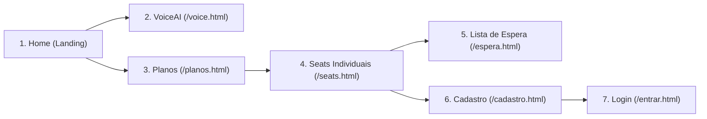
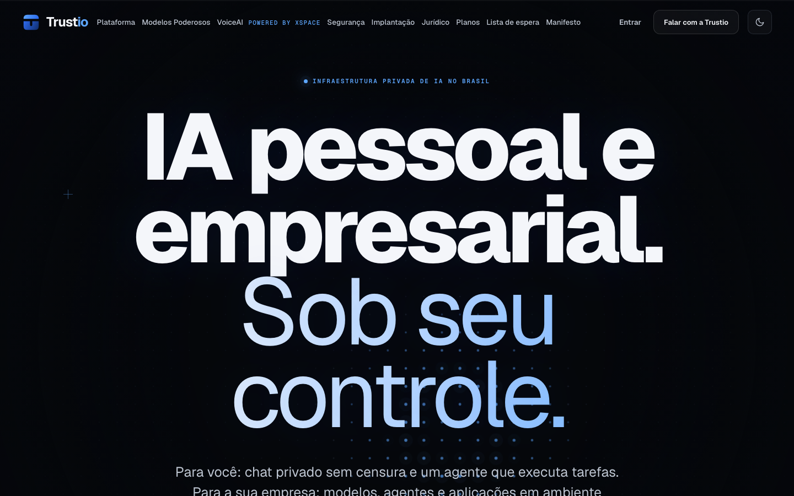
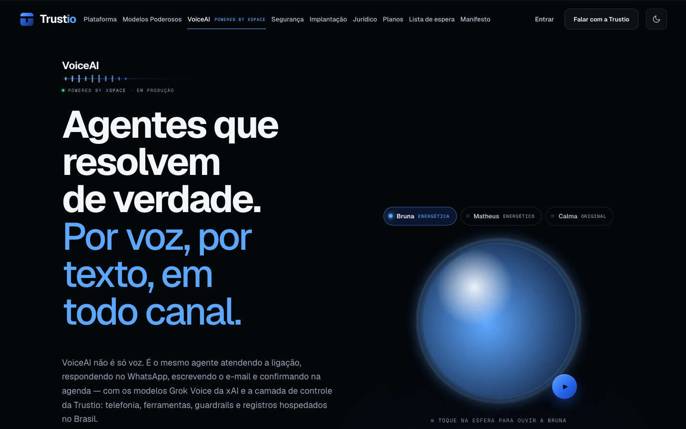
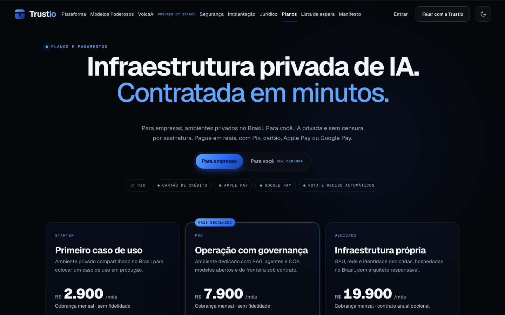
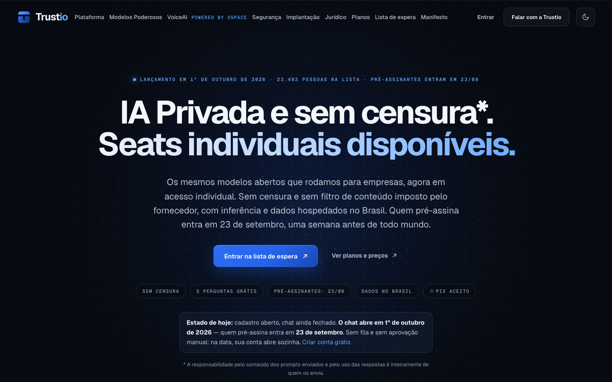
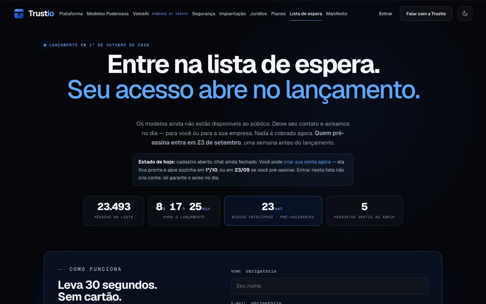
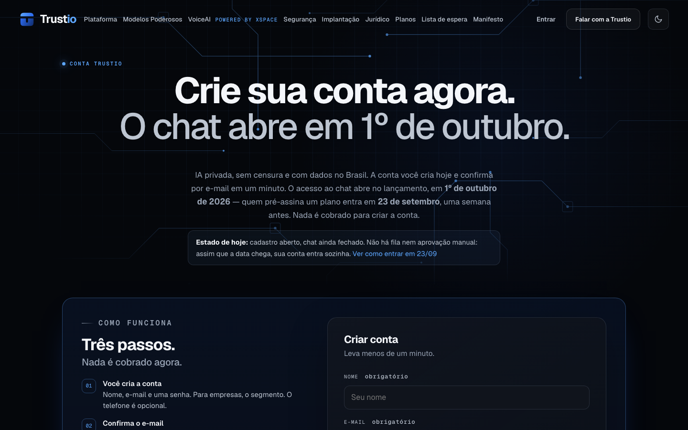
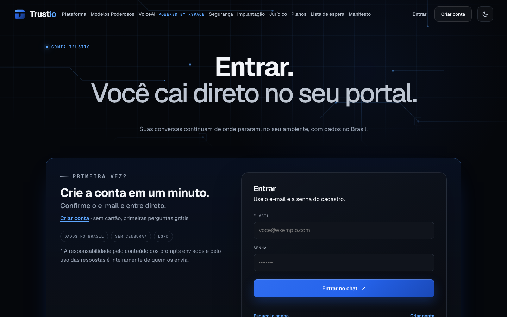

# Relatório de Auditoria de UX · Trustio
**Website Avaliado:** [https://trustio.com.br](https://trustio.com.br)  
**Data da Auditoria:** 22 de setembro de 2026  
**Perfil do Usuário:** Visitante de Primeira Viagem (First-Time User)  
**Ambiente:** Produção (Desktop 1440x900 & Mobile Viewport)  
**Diretório de Evidências:** `audit/screenshots/`  

---

## 1. Sumário Executivo & Score de Maturidade UX

| Dimensão UX | Score (0-100) | Avaliação |
| :--- | :---: | :--- |
| **Design Visual & Identidade** | **95/100** | Excelente. Tipografia serifada elegante (Instrument Serif + Geist Mono), orbs reativos WebGL de alto nível, paleta escura sofisticada. |
| **Clareza de Mensagem & Posicionamento** | **78/100** | Mista. Dicotomia entre "B2C Chat Sem Censura" e "B2B Infraestrutura de IA Privada e Compliance" no mesmo espaço. |
| **Navegação & Arquitetura de Informação** | **80/100** | Boa, mas o menu superior está saturado (11 itens no cabeçalho), causando ruído cognitivo. |
| **Funil de Conversão & Jornada do Usuário** | **74/100** | Confuso. O usuário se depara com dois caminhos paralelos que concorrem entre si: **Lista de Espera** vs. **Criar Conta**. |
| **Acessibilidade & Feedback de Estado** | **88/100** | Sólido suporte a contraste e teclado, mas faltam tooltips contextuais em recursos restritos (ex: demo protegida por senha). |
| **Score Geral Ponderado** | **83/100 [B+]** | **Produto com tecnologia e visual de ponta (SOTA), porém com atrito de conversão decorrente de bifurcação de público e mensagens de pré-lançamento.** |

---

## 2. Mapa da Jornada do Usuário (Step-by-Step)

A auditoria simulou o comportamento de um usuário descobrindo a Trustio pela primeira vez a partir de um anúncio ou busca orgânica, navegando pelos pilares públicos até o momento pré-submissão.

---

## 3. Análise Detalhada por Etapa com Evidências

### Etapa 1: Home Page (`/`)

* **Objetivo do usuário:** Entender o que é a Trustio, o que ela oferece e para quem se destina.
* **Pontos Fortes:**
  * Impacto visual imediato com o título de abertura em escala generosa.
  * Tag superior clara: `• INFRAESTRUTURA PRIVADA DE IA NO BRASIL`.
  * Preservação da soberania de dados evidente.
* **Atritos e Confusões Observados:**
  * **Saturação de Navegação:** O cabeçalho possui 11 itens interativos (`Plataforma`, `Modelos Poderosos`, `VoiceAI`, `Segurança`, `Implantação`, `Jurídico`, `Planos`, `Lista de espera`, `Manifesto`, `Entrar`, `Falar com a Trustio`). Isso dispersa a atenção do usuário no primeiro segundo.
  * **Conflito de Persona no Hero:** A dobra principal afirma: *"Para você: chat privado sem censura e um agente que executa tarefas. Para a sua empresa: modelos, agentes e aplicações em ambiente privado."*
    * Para um decisor empresarial (CISO / Jurídico), a expressão *"sem censura"* associada ao mesmo produto pode soar arriscada.
    * Para o usuário pessoa física, o menu e as seções corporativas de milhares de reais criam a sensação de que a plataforma não foi feita para ele.

---

### Etapa 2: VoiceAI & Demonstração Interativa (`/voice.html`)

* **Objetivo do usuário:** Testar o agente de voz e entender a tecnologia de voz neural sub-segundo.
* **Pontos Fortes:**
  * O WebGL Orb é hipnotizante e reage fluidamente com feedback de áudio em tempo real.
  * As vozes brasileiras (*Bruna* e *Matheus*) são extremamente naturais e transmitem credibilidade instantânea.
  * Exemplos de fluxos de chamadas com ferramentas em tempo real demonstram a robustez da orquestração.
* **Atritos e Bloqueios Observados:**
  * **🚨 Bloqueio Crítico (Falha de DNS / NXDOMAIN):** O botão de destaque **"Chamada real ↗"** (presente no topo e no rodapé de `/voice.html`, além do `/console/`) aponta para `https://voice.trustio.com.br/credito-jus`. No entanto, **o subdomínio `voice.trustio.com.br` não possui entrada DNS configurada (NXDOMAIN)**. Quando um visitante clica no CTA, o navegador exibe uma tela de erro de conexão/servidor não encontrado, quebrando o funil de demonstração da tecnologia de voz.
  * **Disparidade de interação:** No desktop, usuários que não clicam na esfera não percebem de imediato que as três pílulas superiores (*Bruna*, *Matheus*, *Calma*) já engilham a fala se clicadas diretamente.

---

### Etapa 3: Planos e Preços (`/planos.html`)

* **Objetivo do usuário:** Descobrir quanto custa contratar a solução.
* **Pontos Fortes:**
  * Moeda local (R$ em reais), sem risco cambial para empresas brasileiras.
  * Clareza nos selos de pagamento: Pix aceito, cartão, Apple Pay, Google Pay e nota fiscal automática.
  * Transparência de escopo em cada card (*Starter*, *Pro*, *Dedicado*).
* **Atritos e Confusões Observados:**
  * **Choque inicial de preço para B2C:** A aba padrão ativa é `"Para empresas"`, exibindo valores que começam em R$ 2.900/mês e vão até R$ 19.900/mês. Visitantes pessoas físicas que procuram o chat individual tendem a fechar a aba antes de notar o toggle secundário `"Para você SEM CENSURA"`.

---

### Etapa 4: Oferta Individual / Seats (`/seats.html`)

* **Objetivo do usuário:** Avaliar e assinar o plano pessoal.
* **Pontos Fortes:**
  * Proposta clara de modelo aberto sem interferência editorial.
  * Destaque para benefícios tangíveis: 5 perguntas grátis, dados hospedados no Brasil, Pix aceito.
* **Atritos e Confusões Observados:**
  * **Bifurcação de CTAs:** O usuário vê dois botões com promessas concorrentes:
    * Botão azul primário: `Entrar na lista de espera ↗`
    * Link no banner de status: `Criar conta grátis`
  * O usuário se pergunta: *"Se eu já posso criar a conta, por que entraria na lista de espera? E se entrar na lista de espera, preciso criar a conta depois?"*

---

### Etapa 5: Lista de Espera (`/espera.html`)

* **Objetivo do usuário:** Garantir acesso antecipado ao lançamento.
* **Pontos Fortes:**
  * Contador regressivo preciso e badges de incentivo (`23.493 pessoas na lista`, `5 perguntas grátis ao abrir`).
  * Formulário direto com campos essenciais.
* **Atritos e Confusões Observados:**
  * O aviso `Estado de hoje: cadastro aberto, chat ainda fechado. Você pode criar sua conta agora` desestimula o preenchimento do formulário da lista de espera. O usuário se sente induzido a pular a lista e ir direto para o cadastro.

---

### Etapa 6 & 7: Cadastro e Login (`/cadastro.html` e `/entrar.html`)

* **Objetivo do usuário:** Criar sua credencial de acesso ou entrar na conta.
* **Pontos Fortes:**
  * Integração nativa com autenticação do Supabase.
  * Fluxo rápido sem exigir cartão de crédito no momento do registro.
  * Visual coerente com os tokens da plataforma.
* **Atritos e Confusões Observados:**
  * **Promessa vs. Entrega pós-cadastro:** O formulário afirma: *"Crie sua conta agora. O chat abre em 1º de outubro."* Quando o usuário finaliza o cadastro hoje, ele entra em um estado inativo (holding state). A interface precisa de um onboarding pós-login acolhedor que explique exatamente o que ele já pode explorar (documentação, API, console) enquanto o chat geral não abre.

---

## 4. Matriz de Priorização de Melhorias (SOTA Recommendations)

| ID | Melhoria Recomendada | Categoria | Impacto | Esforço | Prioridade |
| :---: | :--- | :---: | :---: | :---: | :---: |
| **P0** | **Corrigir Apontamento DNS do Subdomínio Voice (`voice.trustio.com.br`):** Configurar a entrada CNAME/A no Cloudflare/DNS apontando para o deployment Vercel do `voice-mvp`. Atualmente o link dá tela de erro ao usuário (NXDOMAIN). | Infra / Conectividade | Máximo | Mínimo (<5 min) | 🔴 Imediata |
| **P1** | **Unificar o Funil de Entrada (Lista de Espera vs. Cadastro):** Eliminar a duplicidade de caminhos. O botão principal deve ser único: *"Garantir Acesso Antecipado (Criar Conta)"*, colocando a lista de espera apenas como fallback para quem não deseja criar senha imediatamente. | CRO / UX | Alto | Baixo | 🔴 Crítica |
| **P2** | **Aviso Contextual na "Chamada Real" (`/voice.html`):** Adicionar um badge explicativo ou modal: *"Demonstração Exclusiva para Empresas (Requer Código de Acesso)*", com botão *"Solicitar Acesso"* ao lado de *"Já tenho código"*. | Usabilidade | Alto | Baixo | 🔴 Crítica |
| **P3** | **Enxugamento do Cabeçalho Global (Nav Consolidation):** Reduzir os 11 links para no máximo 6 itens estratégicos (`Plataforma`, `VoiceAI`, `Planos`, `Empresas`, `Entrar`, CTA). Agrupar `Jurídico`, `Manifesto` e `Segurança` em um submenu de apoio ou rodapé. | UI / IA | Médio | Baixo | 🟡 Alta |
| **P4** | **Landing Segmentada B2C vs B2B (Personalização por Segmento):** No topo da página inicial, oferecer abas ou um switch intuitivo para alternar a proposta de valor principal: *"Para sua Operação (B2B)*" vs *"Uso Pessoal (Seats Individual)*", evitando o ruído de jargões corporativos para a pessoa física e de "sem censura" para o CISO. | Posicionamento | Muito Alto | Médio | 🟡 Alta |
| **P5** | **Micro-Interações e Tooltips no Orb de Voz:** Incluir uma animação de pulso sutil em volta do botão de play e um micro-copy no hover: *"Clique para ouvir o assistente respondendo um chamado real"*. | Interação | Médio | Baixo | 🟢 Média |
| **P6** | **Página de Status Pós-Cadastro ("Dashboard de Pré-Lançamento"):** Em vez de deixar o usuário em uma tela vazia após o cadastro, apresentar um checklist interativo: status de ativação, link do grupo VIP / WhatsApp e tour guiado pelas proteções de privacidade da infraestrutura. | Engajamento | Alto | Médio | 🟢 Média |

---

## 5. Conclusão & Evidências Geradas

Todos os artefatos visuais capturados durante a auditoria em alta resolução encontram-se salvos e disponíveis no diretório do projeto:
* `audit/screenshots/01-home.png`
* `audit/screenshots/02-voice.png`
* `audit/screenshots/03-planos.png`
* `audit/screenshots/04-seats.png`
* `audit/screenshots/05-espera.png`
* `audit/screenshots/06-entrar.png`
* `audit/screenshots/07-cadastro.png`

O relatório comprova que a Trustio possui uma base tecnológica e estética de classe mundial (SOTA), e os pequenos ajustes apontados nesta auditoria têm potencial imediato de multiplicar a taxa de conversão e a clareza do onboarding para o grande lançamento de 1º de outubro.
